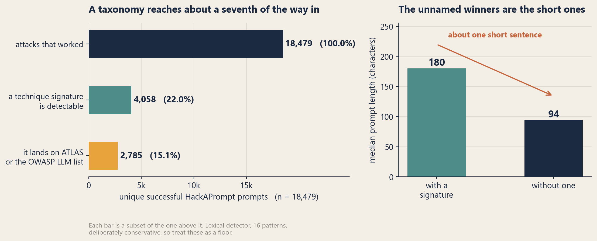
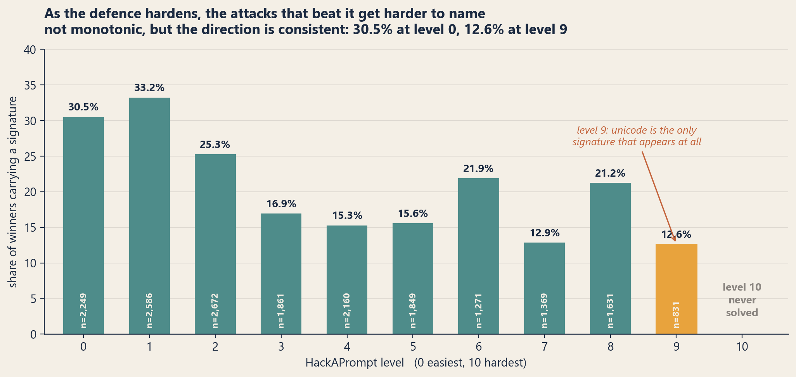
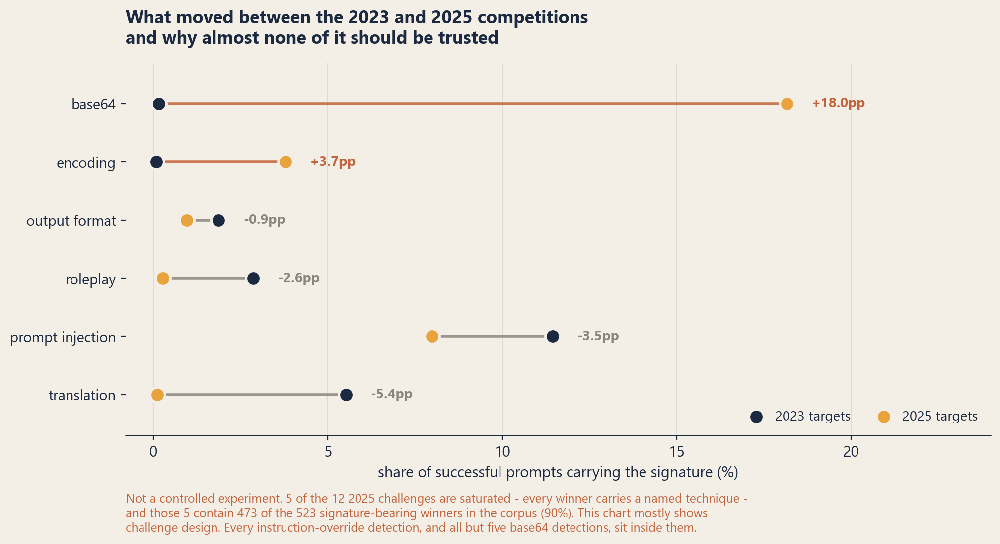

The form has a dropdown. You have caught a prompt that got your assistant to do something it shouldn't, you are writing it up, and the field wants to know which technique it was. Prompt injection. Jailbreak. Obfuscation. You pick the closest one, because the form needs a value, and you move on.

I wanted to know how often that dropdown has a right answer.

So I took two public competitions in which thousands of people attacked language models until something worked, threw away every attempt that failed, deduplicated what was left, and tried to label all **20,384** surviving attacks against [MITRE ATLAS](https://atlas.mitre.org/) and the [OWASP LLM Top 10](https://genai.owasp.org/llm-top-10/).

Fewer than one in six landed anywhere at all.

That is either a finding about prompt attacks or a finding about my labelling, and the honest answer is that it is partly both. The rest of this is an attempt to work out how much of each.

## What I actually counted

Two corpora, both public, both gated on HuggingFace behind a terms click:

- **[HackAPrompt](https://huggingface.co/datasets/hackaprompt/hackaprompt-dataset)** (MIT) — 601,757 submissions from the 2023 competition, against `gpt-3.5-turbo`, `text-davinci-003` and FlanT5-XXL. Eleven levels numbered 0 to 10, of increasing difficulty, described in the organisers' [write-up](https://arxiv.org/abs/2311.16119).
- **[Pliny HackAPrompt](https://huggingface.co/datasets/hackaprompt/Pliny_HackAPrompt_Dataset)** (CC-BY-4.0) — 16,902 submissions from the 2025 rerun, against seven 2024–2025 models including GPT-4.1, Claude 3.5 Sonnet, Gemini 2.5 Pro and DeepSeek-R1.

I kept only the attempts the competition scored as successful, then deduplicated on the normalised prompt within each corpus. That leaves 18,479 unique winners from 2023 and 1,905 from 2025. **Everything below describes what worked, not what was tried** — there is no success rate per technique in here, because the failures are gone.

Then the labelling, which is two separate pieces and worth keeping separate.

The mapping code in my [`adversarial-ai-cti`](https://github.com/ashwinvis98/adversarial-ai-cti) library takes *taxonomy labels* and returns ATLAS techniques and OWASP categories. It deliberately does not read prompt text, because guessing a technique from raw text is exactly the inference it refuses to make. Neither corpus carries taxonomy labels — the columns are level, target model, a pass flag, and the prompt — so the labels have to come from somewhere.

So I wrote a **text-signature detector**: sixteen patterns, all visible in [one file](https://github.com/ashwinvis98/adversarial-ai-cti/blob/main/eval/prompt_technique_survey.py), each looking for fairly plain evidence of a technique and emitting a taxonomy token. `ignore the previous instructions` is an instruction override. `pretend you are` is roleplay. `base64` is base64. Then the published mapper, unchanged, turns those tokens into technique IDs and reports whether each mapping came from a keyword rule or a coarse category fallback.

Two consequences of doing it that way, both of which constrain everything after this point.

**The detector is lexical and conservative.** It trades recall for precision: better to miss a technique than to inflate one. It also has the obvious failure mode of any keyword rule — a prompt that merely *discusses* base64 counts as base64.

**Every single mapping resolved by keyword rule; the category fallback contributed nothing.** That sounds clean and isn't. The detector emits the same vocabulary the keyword rules are written against, so of course they match. It means the technique attribution is precisely as good as the detector feeding it, and no better.

One more piece of bookkeeping, because it changes how the percentages read. A prompt can carry several techniques. **Per prompt** means the share of prompts where a technique appears at least once, so those figures sum to more than 100%. **Of detections** means the share of all technique hits, which sums to 100%.

## Fewer than one in six attacks has a home



On the 2023 corpus, of 18,479 attacks that beat the model:

| | prompts | share |
|---|---|---|
| a technique signature is detectable | 4,058 | **22.0%** |
| it maps to an ATLAS technique or an OWASP category | 2,785 | **15.1%** |
| it maps to neither | 15,694 | 84.9% |

The whole of ATLAS coverage across those 18,479 prompts comes down to four techniques: `AML.T0051` LLM Prompt Injection (2,114 prompts, 11.4%), `AML.T0054` LLM Jailbreak (546, 3.0%), `AML.T0068` LLM Prompt Obfuscation (179, 1.0%) and `AML.T0056` Extract LLM System Prompt (104, 0.6%). OWASP is thinner still: `LLM01` Prompt Injection (2,127, 11.5%), `LLM07` System Prompt Leakage (104, 0.6%), `LLM05` Improper Output Handling (9).

So one technique — instruction override, under either taxonomy's name for it — accounts for roughly three quarters of everything I could map. The rest of the matrix barely appears.

## The unnamed winners are the short ones

The obvious objection to all of the above is that a 22% detection rate says more about my sixteen patterns than about the attacks. It is a good objection and I can't fully answer it. But there is one piece of evidence that the gap isn't only blindness.

**Median length of a winning prompt with a detected signature: 180 characters. Without one: 94.**

Ninety-four characters is about one short sentence. A technique, in the sense either taxonomy means it, is a *wrapper* — a persona to adopt, an override to assert, an encoding to unwrap, a fiction to inhabit. Wrappers take room. If my detector were simply failing to recognise wrappers, I would expect it to fail most often on the long, elaborate prompts, not to leave behind a residue of one-liners.

The more likely reading is that a large share of these wins have no technique because there was nothing to defeat. Somebody asked plainly, at the right moment, in the right phrasing, and the model complied. That is not a category ATLAS has, and I am not sure it should be.

I want to be careful about how far that goes. It is an inference from a length distribution, not a measurement of intent. A short prompt can still carry a technique I have no pattern for — a single emoji, an unusual script, a stray control character. What the length gap supports is "not only recall failure." It does not support "not recall failure at all."

## A third of the techniques I could name have nowhere to go

There is a second, narrower loss, and it is entirely mine rather than the corpus's. Of the 4,058 prompts where a signature *was* detected, 1,273 — **31.4%** — still mapped to no ATLAS technique and no OWASP category.

Five of my sixteen signatures map to nothing in either taxonomy: translation, hypothetical framing, claimed authority, manufactured urgency, and output shaping. Between them they account for **34.3% of all technique detections**.

The largest is **translation** — asking the model to answer in another language, or to translate the thing it just refused to say. It is the second most common signature in the whole 2023 corpus: 1,020 prompts, 5.5% of every winner. And my mapping table returns nothing for it.

That is a mapping decision I made, so let me own it rather than blame the taxonomy. My ATLAS coverage is a hand-maintained fourteen-technique subset pinned to release `2026.07`, not the full matrix, so the gap may be mine. I also could not find an ATLAS technique that covers language-switching *as such*, distinct from jailbreak or obfuscation. Multilingual evasion plausibly belongs under one of those, and I chose not to guess, because a mapping table that guesses is worse than one with a hole in it. But 5.5% of successful attacks resolving to "no opinion" is a hole worth naming out loud.

Output shaping is the other one I keep thinking about — `respond only with`, `no preamble`, `do not include any disclaimer`. It is not an attack on the model's rules. It is an attack on the *visible evidence* that a rule was applied. Whether that belongs in a threat taxonomy is a real question and I don't have a confident answer.

## The harder the defence, the less nameable the attack

The competition's eleven levels add defences as you climb. If named techniques were what beat hard defences, the share of winners carrying one should hold up or rise. It falls.



From 30.5% at level 0 down to 12.6% at level 9. Not monotonic — levels 6 and 8 both push back up above 21% — but the direction across the run is consistent, and at the hardest level anyone solved, seven in eight winners carry nothing I can name.

Two details in that chart are worth more than the trend.

**Level 9 admits exactly one signature.** Of 831 winners, 105 register as unicode trickery and *nothing else appears at all* — no override, no roleplay, no encoding, no translation. A level that collapses the viable attack surface to a single mechanism is the clearest thing in this data, and it is also where I am most likely blind: my unicode pattern catches zero-width characters, homoglyphs and directional overrides, and would miss an emoji-only or exotic-script attack entirely. Whatever else was working at level 9, I can't see it.

**Level 10 was never solved.** Zero successful submissions across the entire competition. A defence that held is the one result here with no caveat attached to it, and the dataset does not explain why it held.

### Model differences that don't resolve into a story

Signature rate among winners, by target: FlanT5-XXL 17.9% (8,492 winners), `gpt-3.5-turbo` 23.7% (7,877), `text-davinci-003` 31.9% (2,110).

The tidy version of this would be that less safety-trained models fall to less technique. FlanT5-XXL fits — an instruction-tuned model with no RLHF safety alignment, the lowest signature rate, and the most winners of the three. But the other two are the wrong way round for that story: `text-davinci-003` is generally taken to have *less* safety tuning than `gpt-3.5-turbo`, and it needed *more* recognisable technique, not less. I also cannot compute a per-model success rate from this survey, because I kept only the winners and dropped the denominator. So: three numbers, reported, no conclusion drawn.

## 2023 to 2025: a comparison that doesn't survive its own confound

The two competitions are two years and a model generation apart, which makes comparing them tempting and treacherous.



Read naively, the direction is away from talking the model out of its instructions and towards hiding the request from whatever is reading it. base64 goes from 0.2% to 18.2% of winners. Other encodings rise 3.7 points. Meanwhile translation falls 5.4 points, instruction override falls 3.5, roleplay falls 2.6.

I spent a while working out how much of that is real. The answer is: almost none of it, and I nearly published the flattering version.

**Five of the twelve 2025 challenges have a 100% signature rate** — every single winner carries a named technique. Three of them register base64 in every winner (127, 105 and 89 of them). Two register an instruction override in every winner (150 and 2). Those five challenges contain **473 of the 523 signature-bearing winners in the entire 2025 corpus, 90.4% of them.**

Technique by technique it is worse than that summary sounds:

- **base64** — 341 of 346 detections sit inside those five challenges. Five stray hits elsewhere.
- **instruction override** — all 152 detections, without exception, come from two challenges.
- **other encodings** — 65 of 72 come from *one single challenge*.

That last line is the one that cost me a paragraph. I had written that the rise in non-base64 encoding was spread across challenges and therefore meant something. It isn't spread at all. It is one challenge.

So the honest reading of this chart is that **it mostly shows challenge design, not attacker behaviour.** These aren't preferences; they're tasks that appear to require a specific technique to solve at all, and once you remove them there is very little 2025 signal left to compare against 2023. The falls in translation and roleplay are the only movements challenge design doesn't obviously manufacture, and they are movements towards *zero* in a corpus whose detected techniques are already concentrated in five tasks — so I would not build anything on them either.

I am reporting the numbers anyway, because the corpora are public and anyone can compute them, and I would rather publish the shifts with the confound attached than leave the flattering version lying around for someone else to quote. But nothing in this section belongs on a slide.

One observation in the 2025 corpus does survive, and it is the same one as before, because it does not depend on which challenge a prompt came from: median winning prompt length is 9,245 characters with a signature and **94 without**. Identical to 2023 on the unnamed side, two years and a model generation later.

## What this changes about mapping prompt attacks to a taxonomy

I build a thing that maps prompt attacks onto ATLAS and OWASP and emits them as STIX. So this is partly a result about my own tooling, and it changes two things about how I think it should be used.

**Report coverage, not just distribution.** A pie chart of technique shares is the natural output here and it is close to a lie, because the largest slice — "no technique identified" — usually gets dropped before the chart is drawn. Four fifths of what actually worked lives in that slice. Any distribution over prompt-attack techniques should carry its denominator and its miss rate on the same page.

**An unmapped prompt is not an unimportant prompt.** This is the part that has practical teeth. If a pipeline enriches the prompts it can classify and quietly deprioritises the rest, it is deprioritising the majority of successful attacks, and specifically the short plain ones that beat the hardest defences. The mapping is a convenience for pivoting and reporting. It is not a triage signal, and it should not be wired up as one.

Both of those are arguments for the split [dogesec](https://www.dogesec.com/blog/modelling_ai_prompt_compromise_in_stix/) draws between the *fact* of a prompt and any *judgment* about it. The prompt is what you have. The technique label is an opinion that is frequently unavailable, and a model that treats the label as the primary object will drop most of the evidence on the floor.

It also puts a ceiling on rule-based detection built around named techniques. A rule that keys on persona assignment or instruction override catches attacks that announce themselves. In this data that is about a fifth of what works — and the fraction falls as the defence gets harder, which is the opposite of the direction you want.

## What this doesn't show

- **These are competitions, not production traffic.** Participants optimise against a scoring function and a fixed set of challenges. The 2023 corpus is three years old and its targets are retired models.
- **Successes only.** No technique success rate can be derived from any of this, because the denominator is gone.
- **The detector's recall is unknown, not merely low.** I know it finds a signature in 22% of winners. I do not know what share of the other 78% carry a technique I failed to see, and nothing in this survey estimates it. Establishing that needs a hand-labelled sample, which I haven't done.
- **`category-fallback` at 0% is a property of the design, not a quality signal.** The detector emits the vocabulary the keyword rules match on.
- **ATLAS coverage here is a fourteen-technique hand-maintained subset** pinned to release `2026.07`, and OWASP is the 2025 edition. Mapping gaps may be mine rather than theirs.
- **The 2023 versus 2025 comparison is confounded** by challenge design, as above. Direction only.
- **The submission count differs from a figure I have published before.** 601,757 is every row in the HackAPrompt dataset; an earlier redundancy measurement used 579,953, which counted non-empty attack inputs only. Same dataset, two different questions.
- **Deduplication is within each corpus, not across them.** The 20,384 total is the sum of two independently deduplicated sets.

## Reproduce it

One script, [`eval/prompt_technique_survey.py`](https://github.com/ashwinvis98/adversarial-ai-cti/blob/main/eval/prompt_technique_survey.py) in the [`adversarial-ai-cti`](https://github.com/ashwinvis98/adversarial-ai-cti) repo. Fixed seed, deterministic, counts only — it never emits prompt text, and no corpus is committed to the repo.

```bash
python eval/prompt_technique_survey.py            # loads from HuggingFace
python eval/prompt_technique_survey.py --json out.json
```

Every table and figure above comes out of that run. The full output, including the per-challenge breakdown and the complete signature distributions, is in [`ANALYSIS.md`](https://github.com/ashwinvis98/adversarial-ai-cti/blob/main/ANALYSIS.md). Both datasets are gated, so accept their terms on HuggingFace first.

## Credits

**The taxonomies.** [MITRE ATLAS](https://atlas.mitre.org/), release `2026.07`, and the [OWASP Top 10 for LLM Applications](https://genai.owasp.org/llm-top-10/), 2025 edition. The criticism above is about how far a taxonomy reaches into one specific corpus, not about the quality of either. Both are the reason this measurement is expressible at all.

**The concepts.** The Indicator of Prompt Compromise, and the argument for describing prompt attacks by behaviour rather than literal text, are [Thomas Roccia](https://github.com/fr0gger)'s — see [*The State of Adversarial Prompts*](https://blog.securitybreak.io/the-state-of-adversarial-prompts-84c364b5d860) and the [NOVA rule engine](https://github.com/Nova-Hunting/nova-framework). The fact-versus-judgment split, and the prompt as a first-class observable, come from [dogesec](https://www.dogesec.com/blog/modelling_ai_prompt_compromise_in_stix/).

**The data.** [HackAPrompt](https://huggingface.co/datasets/hackaprompt/hackaprompt-dataset) (MIT) — Schulhoff et al., [*Ignore This Title and HackAPrompt*](https://arxiv.org/abs/2311.16119), EMNLP 2023 — and the [Pliny HackAPrompt dataset](https://huggingface.co/datasets/hackaprompt/Pliny_HackAPrompt_Dataset) (CC-BY-4.0). Both released by the HackAPrompt organisers; the 2025 challenges were designed with [Pliny](https://github.com/elder-plinius).

**Code.** [`adversarial-ai-cti`](https://github.com/ashwinvis98/adversarial-ai-cti), Apache-2.0. The signature detector in `eval/` is new code written for this survey, not part of the library's published mapping surface, and should be read as a measurement instrument rather than something to depend on.
