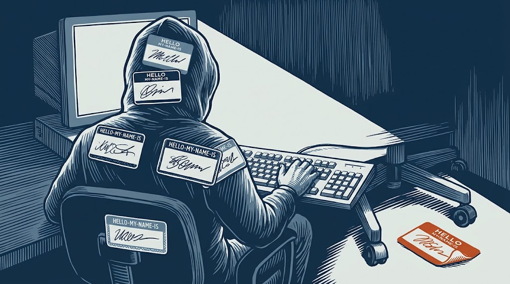
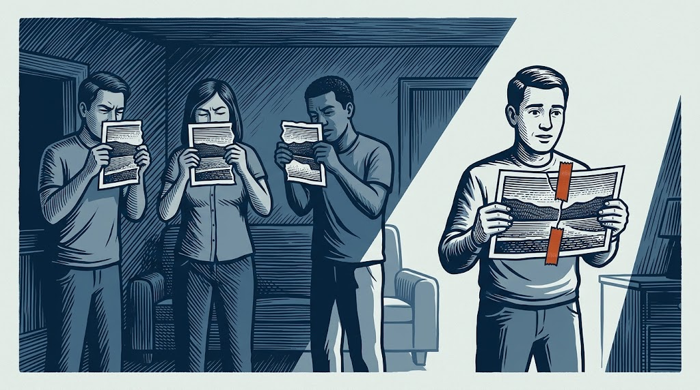
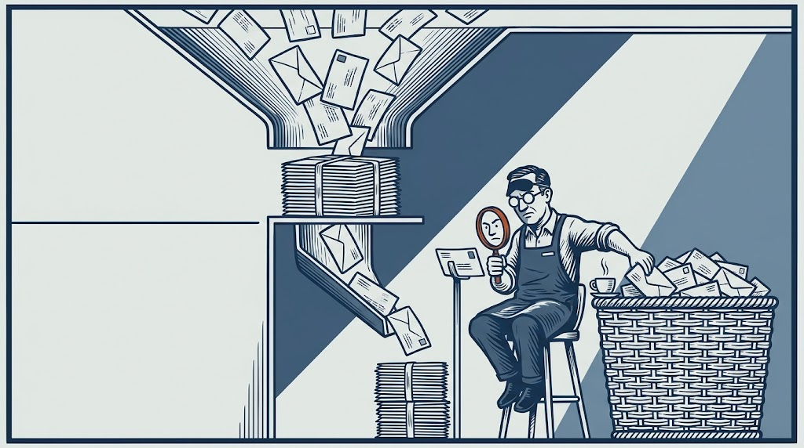
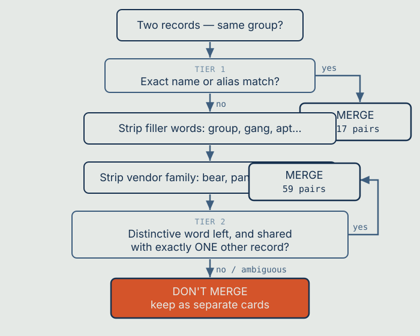
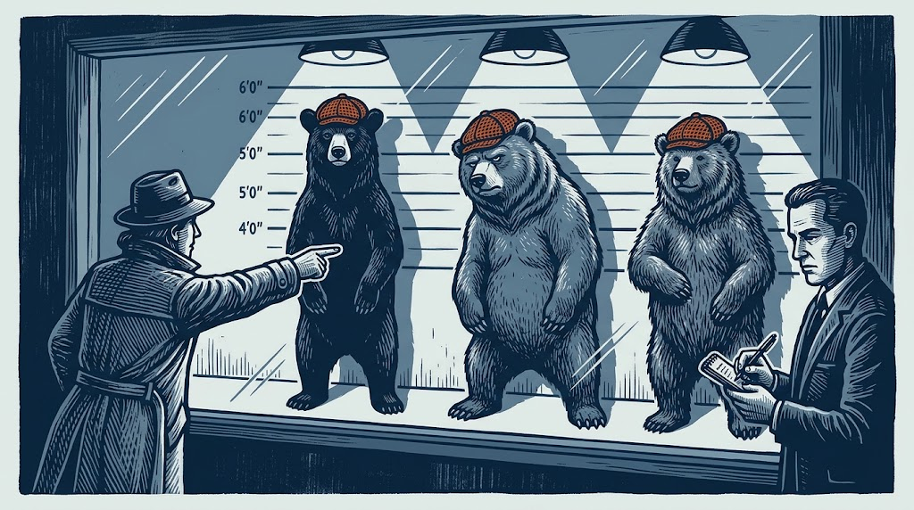
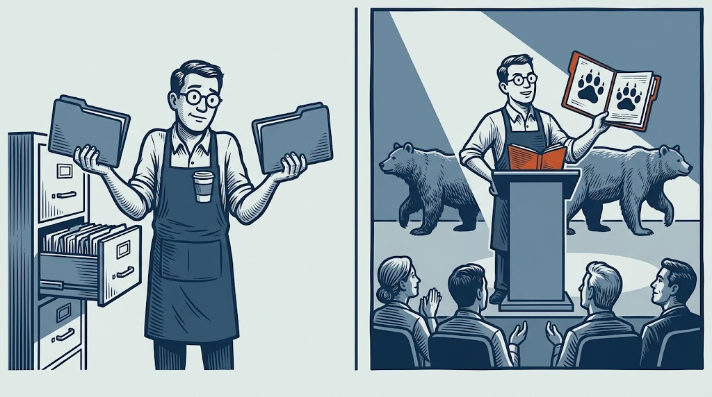

## One villain, a closet full of masks

Let me introduce you to a hacking group. Or maybe six of them. It depends who you ask.

- The researchers at MITRE call it **APT29**.
- CrowdStrike named it **Cozy Bear**.
- Microsoft tracks it as **Midnight Blizzard**, and previously **NOBELIUM**.
- Older reporting calls it **The Dukes**.
- The team that unravelled the SolarWinds attack labelled it **UNC2452**.

These are not six groups. They are one: a Russian state-sponsored espionage operation that Western governments have publicly tied to Russia's foreign intelligence service, the SVR. MITRE tracks it as [G0016](https://attack.mitre.org/groups/G0016/), CISA published [advisory AA24-057A](https://www.cisa.gov/news-events/cybersecurity-advisories/aa24-057a) on it, and Microsoft maintains [a profile](https://www.microsoft.com/en-us/security/security-insider/midnight-blizzard) under its own name for the group. Same people, same keyboards, half a dozen names depending on which company's report you happened to be reading.

Here's the problem that lands on anyone building a *knowledge base* out of this. If the system thinks APT29 and Cozy Bear are two different groups, then every question about either one gets half the story. This is how I taught a threat-intelligence assistant that many names can mean one villain, and the genuinely counterintuitive lesson I learned about when *not* to be clever.

## Why does one group have six names?

It's tempting to assume this is sloppiness. It isn't. It's structural, and understanding why matters for the fix.

Different security companies discover and track threats independently. Each has its own telescope pointed at the internet: its own sensors, its own victims calling for help, its own analysts. When a company identifies what looks like a distinct group, it names that group in its own house style. CrowdStrike uses animals tied to a suspected country — Bear for Russia, Panda for China. Microsoft uses weather: Blizzard for Russia, Typhoon for China. Mandiant uses sober codes like UNC####. Others use numbers, mythology, or something catchy for a report cover.

The industry openly acknowledges the mess. Trade press has described the tangle of overlapping names as [confusing but essential](https://www.techtarget.com/searchSecurity/feature/Vendors-Threat-actor-taxonomies-are-confusing-but-essential/), and in 2025 CrowdStrike and Microsoft announced a joint effort to [harmonise their threat-actor names](https://www.crowdstrike.com/en-us/press-releases/crowdstrike-microsoft-collaborate-deconflict-cyber-threat-attribution/) precisely because the fragmentation slows defenders down. When the two biggest names in the industry launch a project just to agree on what to *call* things, the problem is real.


For a human analyst this is an annoyance you learn to live with. For an automated knowledge base it's a landmine.

## Why fragmented names wreck an AI's answers

In [a companion piece on turning a threat graph into readable cards](/writing/teaching-a-chatbot-to-read-a-spider-web/) I described how I flatten threat data into plain-language entity cards: one document per entity, holding what's known about it. The whole approach depends on each card being *as complete as it can be*.

The raw data didn't give me one APT29. It gave me two overlapping records, because it had ingested feeds that model the same adversary differently. One record filed under **APT29**, carrying the malware and techniques MITRE documented. A separate record filed under a vendor's own name for the group, carrying the relationships that vendor observed. The other nicknames — The Dukes, NOBELIUM, UNC2452 — mostly arrive as *aliases* attached to one record or the other, which turns out to be the thing that saves you.

Each record held a *different subset* of the truth. So generating a card per record would produce two thin, half-empty cards for one group. Ask what APT29 uses and you'd get only the fraction of the evidence filed under that particular name. The rest would be invisible, because as far as the search was concerned those were different entities entirely.

Half a card is worse than it sounds. In a system meant to inform security decisions, a *confidently incomplete* answer is dangerous. The assistant wouldn't say "I only have partial data." It would answer from the thin card and sound perfectly sure.



So the records had to be merged. Which sounds easy, until you try.

## The real problem: is this the same as that?

The technical name for what I needed is **entity resolution**, or *record linkage*: deciding whether two records refer to the same real-world thing. It's an old, well-studied problem, and you've met it in everyday life. Your phone asks whether to merge two contacts because "Mom" and "Jane Smith" share a number. A bank has to decide whether "Robert Smith," "Bob Smith," and "R. Smith" are one customer or three.

Easy cases are easy. The trouble is the hard cases, and in threat intelligence the hard cases are vicious, because the names were designed by different people to be memorable rather than matchable. "Cozy Bear" and "APT29" share not a single letter. Nothing about the strings themselves tells you they're the same. You need outside knowledge — the *aliases* — to connect them.

And there's a trap waiting on the other side. Get too aggressive about merging and you commit the cardinal sin: fusing **two genuinely different groups** into one card. Now the knowledge base actively lies. It tells an analyst that Group A uses Group B's malware, sends them chasing the wrong adversary, and there's no error message. Just a confident, wrong answer.

So I'm threading a needle: merge the true duplicates, never merge two distinct groups.

## Two passes, cautious by design

I built the matcher in **two tiers**, from most certain to least certain. The rule throughout: when in doubt, don't merge.

### Tier 1: names and known aliases

The first pass is strict and boring, which is exactly what you want for the high-confidence cases. I take every group and build a list of all its known names and aliases, including splitting comma-separated alias strings so each nickname stands on its own. Then I check whether any name or alias of one record exactly matches a name or alias of another, ignoring capitalisation.

This is the pass that catches "Cozy Bear = APT29," because reputable sources *already list* Cozy Bear as an alias of APT29. I'm not guessing; I'm trusting the aliases the intelligence community has already established. On my data this pass merges a few hundred pairs, and I've found nothing wrong in it. Exact matching on established aliases is about as safe as this gets.

### Tier 2: the careful fuzzy pass

Tier 1 misses cases where two vendors wrote a name *slightly* differently: a spelling drift, an extra word. For those leftovers I use a fuzzy match, but a heavily constrained one, because fuzzy matching is exactly where false merges are born.

Here's the part worth slowing down for. When you break threat-actor names into words, certain words turn out to be traps, and there are two kinds.

**Generic filler words** — "group," "gang," "team," "ransomware," "APT," "operation." Plenty of unrelated groups share these. Match on "group" and you'd merge half the database.

**Vendor family words** — the sneaky ones. Remember CrowdStrike's animals and Microsoft's weather? That means **Bear, Panda, Spider, Typhoon, Blizzard** appear across *many different* groups. "Cozy Bear," "Fancy Bear," and "Venomous Bear" are three completely different groups that happen to share "Bear" because they're all suspected Russian. Match on "Bear" and you'd fuse Russia's entire roster into one monster.

So before the fuzzy match runs, I strip out both kinds of trap word — the generic filler and the vendor family words, which I keep as an explicit list. Very short fragments get thrown away too. What's left is the *distinctive* part of a name.

Then the final safety catch: I only accept a fuzzy match if the leftover distinctive word is shared with **exactly one** other group. If a word points at two or more candidates it's ambiguous, so I refuse to merge. Uniqueness is the whole safeguard.

Two examples make it click, and both are refusals, which tells you something about how the pass is tuned.

**"Blue Tempest"** is two vendor family words back to back. Strip them and nothing distinctive is left at all, so the pass declines and the record keeps its own card. Better standalone than guessed.

A name ending in **"Army"** looks more promising — "army" survives the filler list. But plenty of unrelated crews style themselves an army, so that token points at several candidates rather than one. Ambiguous, so it's discarded too.

A merge only happens when what's left is genuinely unusual *and* points at exactly one other record. That's a narrow gate on purpose, and most names that reach it don't get through.

This second pass adds a few dozen more merges on top of the first, only where a genuinely distinctive name pointed at exactly one match. It is also, as I found out later, where all of my errors were.



Drawn as a decision path:





## A wrong merge is worse than no merge

Here's the insight that reshaped how I thought about the whole feature, and it runs against a data engineer's every instinct.

Normally, when you build a matching system, you obsess over *recall*: catching every possible duplicate. A missed duplicate feels like failure. So you keep adding cleverer rules — handle abbreviations, handle misspellings, handle leet-speak where "Clop" gets written "Cl0p" with a zero.

I deliberately stopped adding rules. I left real duplicates un-merged on purpose. The reason is the consumer.

My consumer isn't a human who can shrug off a glitch. It's a language model that will confidently repeat whatever I feed it. That changes the maths entirely, because the two ways of being wrong are not symmetrical.

A **missed merge** leaves a group with two cards instead of one. Not ideal, but if an analyst asks by either name they still get a real, accurate card. The worst case is that they miss some evidence filed under the other name. Incomplete, but not wrong.

A **false merge** produces one card claiming Group A did the things Group B did. The assistant states it as fact. An analyst attributes an attack to the wrong adversary, builds the wrong defence, chases the wrong lead. Confidently, invisibly wrong.

In a system people trust to make security decisions, the second failure is far more expensive than the first. A missing fact is a gap. A wrong fact is a trap. So I tuned the whole thing to prefer gaps over traps: precision over recall. When I wasn't sure, I left the records apart.



## Saying no to obvious improvements

That principle led me to reject changes that looked like clear upgrades on paper.

**Suffix stripping.** Should "Wizard Spider" and "Wizard Spider Group" be treated as identical? Almost certainly yes. But a rule that strips trailing words like "Group" opens the door to fusing names that only *look* similar. The handful of extra correct merges wasn't worth the risk of one wrong one.

**Leet-speak folding.** "Cl0p" and "Clop" are the same ransomware crew. A rule normalising zeros into o's and ones into i's would catch it. It would also start "correcting" names where those characters are meaningful, quietly manufacturing false matches. I left it out.

Each of these would have nudged recall up a point or two. Each also widened the crack a false merge could slip through. Given gaps-beat-traps, the decision made itself.

That's an uncomfortable thing to write in an engineering post: *I chose to catch fewer duplicates on purpose.* But it was the right call for a system whose job is to be trusted.

## Then I went and checked

Everything above is what I designed and what I believed when I first wrote this. Then I did the thing I should have done first: I re-ran the matcher over an export and read every pair it produced.

The strict first pass held up. The fuzzy pass did not. **Ten of its fifty-six matches were wrong** — an 18% false positive rate in exactly the tier I'd described as cautious. Two of them were genuinely bad:

```
[peoples]   Democratic People's Republic of Korea  <->  People's Liberation Army
                                                        Strategic Support Force (China)
[ministry]  Ministry of Intelligence and Security  <->  Ministry of State Security
            (Iran)                                      (China)
```

I had merged two different countries' state apparatus. Twice. In a system whose entire argument is that a wrong merge is worse than a missed one.

The rest were the same shape: `Magnet Goblin` with `Goblin Panda`, `Banshee` with `Void Banshee`, `Curious Serpens` with `Curious Gorge`, and — my favourite — a placeholder record literally named `Unknown` merged with "Unknown satellite signal hijack actor."

The uniqueness rule wasn't broken. It did exactly what I built it to do. The failure was one level up, in what I'd let count as *distinctive*, and the reason is worth sitting with:

I built the trap-word list by frequency. Any token appearing in five or more records got excluded, which is how "bear" and "panda" and "typhoon" ended up on it. But Tier 2 *requires* a token to point at exactly one other record. So the rule is structurally blind to precisely the vocabulary that collides in two records and no more — and that's where vendor naming schemes quietly overlap, because they all draw on the same pool of evocative nouns. Frequency-based stop-listing can only see the collisions that are already common. It cannot see the ones the rule selects for.

And "peoples" and "ministry" were never vendor vocabulary at all. They're ordinary institutional English, long enough to clear the minimum length, rare enough in a corpus of threat actors to look unique. I'd stop-listed the words that sound like threat intelligence and left the words that sound like government.

The fix was unglamorous: institutional and geopolitical vocabulary added to the trap list, the handful of shared creature-nouns added too, placeholder names barred from matching on any tier. That removes all ten and costs nothing — the legitimate merges are unchanged. It's now covered by tests that assert each of those ten pairs stays apart, which is coverage the matcher should have had from the start and didn't.

## Where it landed

A few hundred merges from the strict first pass, a few dozen from the fuzzy one, all fused into complete single cards. Every group I couldn't confidently merge kept its own card, ready to be improved later if better alias data arrives.

The payoff is the APT29 card from the companion piece. It carries the *union* of the evidence that used to sit in two separate records — the malware, the techniques, the targets pooled under one entity, findable by any of its names. Ask about Midnight Blizzard, ask about NOBELIUM, ask about Cozy Bear, and they all land on the same story. Which is how a threat analyst already thinks about them.

Pooled, not exhaustive: the merged card still caps each relationship list rather than printing everything, so it's the well-attested core of what both records knew rather than a complete dossier.

Worth being precise about what that is not. Those merges are the ones I could justify, not the full set that exists in the data. I know there are real duplicates still sitting apart, because the rules I declined to add would have found some of them. The gap is deliberate, and unlike the false merges it is *not* measured — I can't tell you how many I'm missing, only that the number isn't zero. Better alias data upstream would shrink it faster than any cleverness in the matcher.

## The broader lesson

Strip away the security specifics and this is a story about **matching identities in messy data**, a problem that shows up in customer databases, medical records, product catalogues, and just about every data-merging project ever attempted. Two lessons travel well beyond threat intelligence.

**The dangerous words are the common ones.** The tokens that feel like strong signals — "Bear," "Group," "Corp," "Inc" — are often the ones shared by things with nothing to do with each other. Knowing your domain well enough to identify and *remove* those traps is more than half the battle.

**Know who's reading your data, and tune your errors for them.** A dashboard a human scans can tolerate over-eager merging; a person spots the weird result and moves on. An AI that speaks with authority cannot. It launders your mistakes into confident prose. When the consumer can't sanity-check you, precision beats recall, and a gap beats a trap every time.

There's a third lesson I'd rather have learned some other way. **An argument for precision is not the same as having measured your precision.** I designed carefully, reasoned about failure modes correctly, wrote all of this down — and still shipped ten false merges, because I had never once sat down and read the output. The design thinking was sound and it was not a substitute for checking.

I set out to teach a machine that Cozy Bear and APT29 are the same villain. The harder lesson was teaching it when to admit it *wasn't sure* — and then finding out I had to learn the same thing myself.

Keeping all of those cards current as new reporting lands is a separate problem, and one I've written about in [a piece on refreshing the library without rebuilding it](/writing/from-half-a-day-to-a-coffee-break/).

---

### Sources and further reading

- MITRE ATT&CK, APT29 (G0016) — <https://attack.mitre.org/groups/G0016/>
- CISA advisory AA24-057A — <https://www.cisa.gov/news-events/cybersecurity-advisories/aa24-057a>
- Microsoft Security Insider, Midnight Blizzard profile — <https://www.microsoft.com/en-us/security/security-insider/midnight-blizzard>
- CrowdStrike and Microsoft on threat-actor naming harmonisation, 2025 — <https://www.crowdstrike.com/en-us/press-releases/crowdstrike-microsoft-collaborate-deconflict-cyber-threat-attribution/>
- TechTarget, "Threat actor taxonomies are confusing but essential" — <https://www.techtarget.com/searchSecurity/feature/Vendors-Threat-actor-taxonomies-are-confusing-but-essential/>

*External sources were paraphrased and summarised rather than quoted.*
