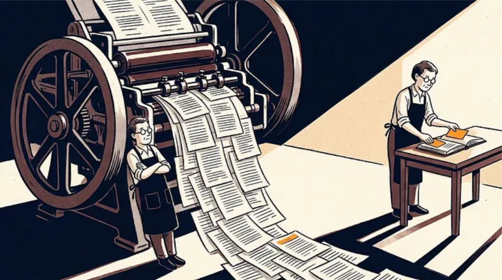
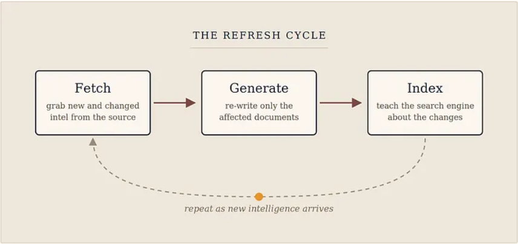
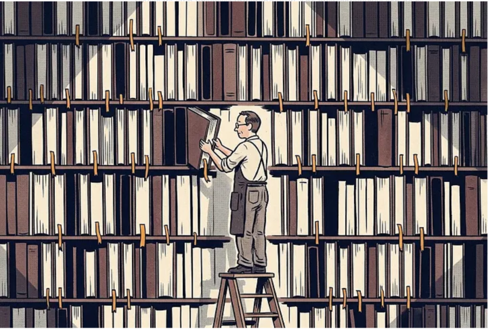
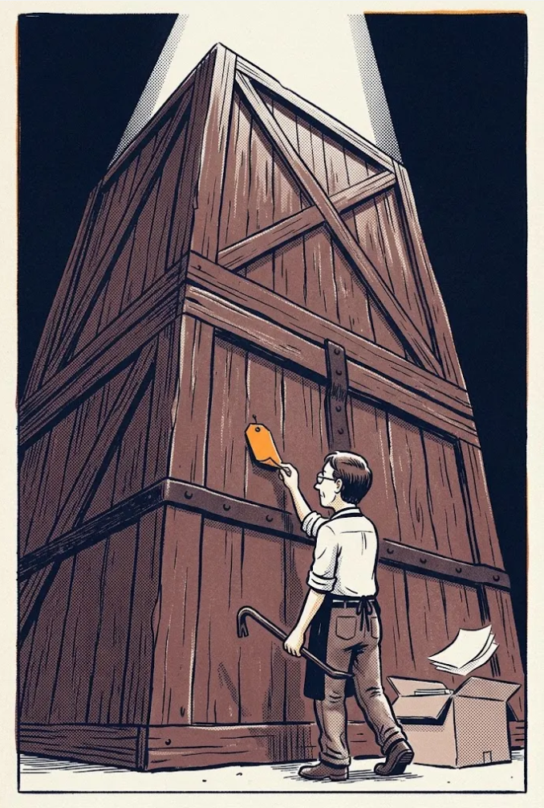
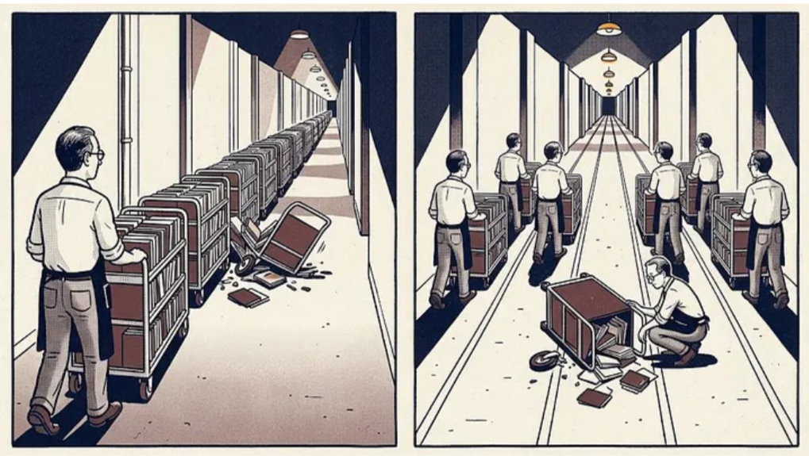
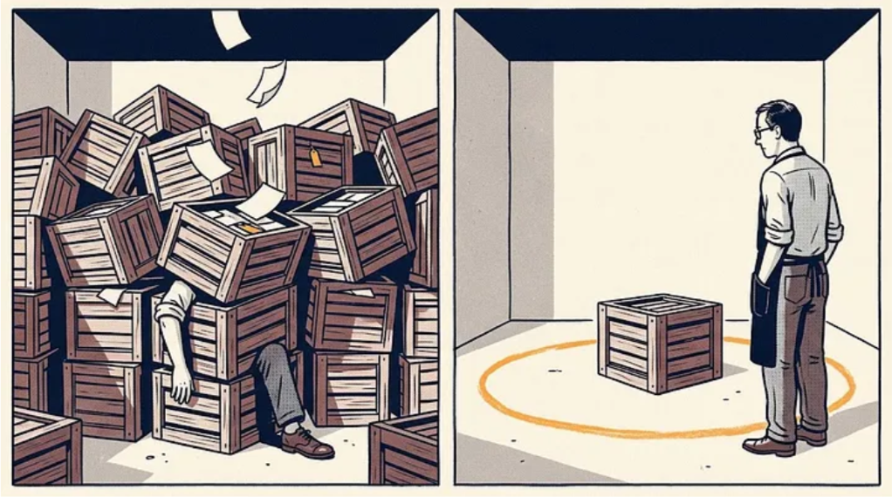
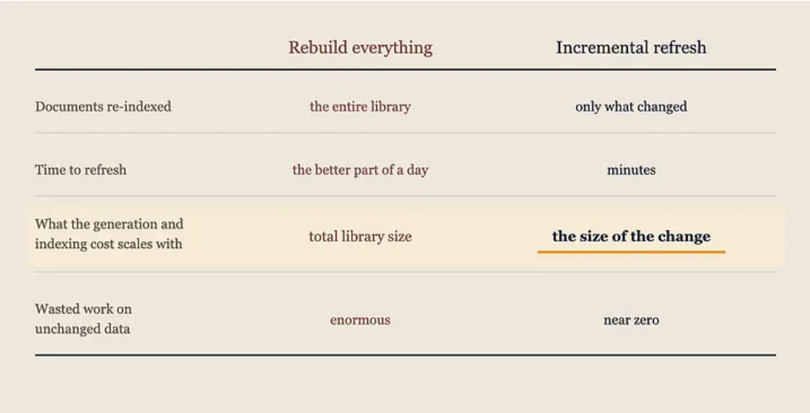

_How I keep an AI threat-intelligence knowledge base, built to scale to millions of documents, fresh in near real time without ever rebuilding it from scratch._

## The dumbest version of this system (and why I almost built it)

Let me describe the simplest possible way to keep an AI knowledge base up to date, because it's the way almost everyone starts, and it's a trap. It nearly caught me, for the reason these things usually catch people: it works. It works on the first day, it works on the test data, and it keeps working right up until the volume makes it unaffordable, by which point it's load-bearing.

I'm building an AI knowledge base of the threat landscape: the actors and the campaigns attributed to them, the malware families and tooling they run, the tactics, techniques and procedures behind those operations, the vulnerabilities they weaponise, the sectors and geographies they aim at, and the detections and mitigations that answer back. It's already a vast library, built to scale to millions of documents, because the landscape it mirrors only ever grows.

Intelligence arrives around the clock and almost none of it is a clean insert. A vendor publishes an alias that turns out to be a group you already track under another name. A CVE lands on CISA's Known Exploited list and every actor profile touching it needs to say so. Activity that two vendors tracked separately turns out to be one operation, or one cluster turns out to be two. Attribution is provisional by nature and the corpus has to hold that. At any given moment a handful of documents need updating, a few new ones appear, and the overwhelming majority are exactly as they were.

The naive approach: rebuild everything, over and over. Re-fetch all the data, re-generate every document, and re-index the whole library into Amazon Bedrock Knowledge Bases. It's simple. It's obviously correct. And it is absurdly wasteful: the equivalent of reprinting an entire encyclopedia, cover to cover, because a handful of facts changed.

I know exactly how wasteful, because I measured it. Rebuilding the knowledge base from scratch, the step where the AI re-reads and re-indexes every document, takes the better part of a day. At the scale I'm building toward, a from-scratch rebuild would grind on for days. Doing that on any regular basis would mean the system spends most of its life re-reading documents byte-for-byte identical to the last pass, burning compute to accomplish nothing.

The version I actually run applies each fresh wave of changes in minutes. Fast enough to keep the knowledge base current in near real time, however large it grows. And that last part is the whole secret: the cost of an update tracks what changed, not how much you've stored. The same quick refresh holds whether the library is a fraction of its eventual size or many times bigger.

This is the story of the difference. It's not one clever trick. It's the same stubborn idea applied at every layer of the system: never redo work you've already done. Let me walk you through it, because the ideas are simple and they apply to almost any data system you'll ever build.

## What "keeping it fresh" actually involves

First, the shape of the work. The pipeline runs as a repeating cycle of three acts:

1. **Fetch:** pull the latest intelligence from OpenCTI.
2. **Generate:** turn that raw intelligence into the finished documents the assistant actually reads, a readable profile for each thing I track. (How those get written is a subject in its own right, and a later piece covers it.)
3. **Index:** feed the updated documents to Amazon Bedrock Knowledge Bases so it can find them.

The naive design would run all three acts over the entire dataset. My job was to make each act touch only what actually changed, because that's what makes the cycle cheap enough to run again and again, keeping the knowledge base close to live. Act by act, then.

## Idea #1: leave a bookmark (the watermark)

Threat intelligence does not arrive in tidy releases. Feeds publish continuously, reporting lands when somebody finishes an investigation rather than on a schedule, and the same event can reach you three times from three sources within a day. So the first question any refresh has to answer is the least glamorous one: what does "changed since last time" actually mean when nothing upstream is synchronised with anything else?

The answer is that the system leaves itself a bookmark. Every time the pipeline finishes a run, it writes down a timestamp: "I have processed everything up to this exact moment." That saved timestamp is the watermark. On the next run, the system reads the bookmark and asks OpenCTI for one thing only: "give me everything modified after this time." Everything older is already handled; it gets skipped entirely.

It's the same thing you do with a book you're reading over many nights. You don't start from page one every evening to find your place; you open to the bookmark and carry on. The pipeline reads the world's threat intelligence the same way, picking up where it stopped rather than wiping its memory and relearning the whole book each night. The watermark is the dog-ear.

There's one subtlety worth mentioning because it bites people: clocks. The machine doing the fetching and the machine holding the data don't have perfectly synchronized clocks, and records can be saved in the split-second the bookmark is written. So I deliberately rewind the bookmark by a small safety margin and accept a tiny bit of overlap. Re-processing a handful of records twice is harmless. Missing one because of a clock hiccup is not. When in doubt, overlap.

## Idea #2: one bookmark per topic, not one for the whole library

Here's where it gets a little smarter. The documents come in categories, and the thing to understand is that they move at wildly different speeds. Vulnerability records are a firehose: tens of thousands of new CVEs a year, plus a constant churn of scoring changes and reference updates on ones already published. Actor and campaign reporting is bursty and unpredictable: quiet for weeks, then a research team publishes and a dozen profiles need rewriting at once. The technique taxonomy, by contrast, barely moves. It gets a considered update a couple of times a year, and between those releases it is effectively a fixed reference frame.

Treating that as one undifferentiated stream costs you. With a single bookmark for the whole library, a hiccup in the busiest category drags the slow, stable ones back with it, and you spend an afternoon regenerating a taxonomy that hasn't meaningfully changed since spring.

So instead I keep a separate bookmark for each category. Each category tracks its own progress independently. The busy categories can be re-processed without disturbing the quiet ones; a problem in one category never drags the others back to square one. And it gives me a lovely operational lever: if I ever want to force a single category to rebuild completely, say because I improved how a particular kind of profile is written, I just erase that one bookmark. The system sees "no bookmark here," assumes it's starting fresh for that category, and rebuilds only that slice. Everything else keeps humming along incrementally.

## Idea #3: the sneaky problem — things change because their neighbors changed

This one tripped me up. You'd think "what changed?" is obvious: whichever records were edited. That intuition holds up fine for a folder of PDFs. It falls apart in threat intelligence, because in this domain the facts that matter mostly aren't attributes of anything. They're claims about how two things relate. An actor uses a loader. A campaign is attributed to an actor. A technique turns up against a sector nobody had seen it aimed at before. None of that lives inside any single record. Which means the thing an analyst most needs to be current is precisely the thing least likely to trip an edited-since check.

Take a well-documented actor, one of the ones with a decade of reporting behind it. Its own record is stable: aliases settled, description written years ago, attribution unmoved. Then a report drops tying it to tooling it hadn't been associated with before. Nothing about the actor was edited. Nobody touched that record. But ask the assistant what that group runs, and the answer it gives is now behind the reporting.

That's the failure mode worth designing against, because it is silent. A missing document announces itself. One that is present, confident, well formatted and quietly a fortnight behind the reporting is the one that burns an analyst mid-investigation.

So I stopped letting "edited" define stale. Freshness in a connected corpus isn't a property a record carries by itself; it belongs to the record and its surroundings together. Each cycle the pipeline therefore asks the broader question: not only what moved, but what now reads differently because something near it moved. Whatever fails that test gets rewritten, whether or not a byte of its own data changed.

An honest note on how far that goes. Each relationship is written onto the documents configured to show it: often both endpoints, sometimes just one, depending on which view is worth carrying. The useful property is that the staleness check and the renderer read from the same configuration. So coverage is consistent by construction: a document gets refreshed exactly when a relationship it actually displays changes. There's no gap where a card shows something but fails to notice it moved. Finding that set does still mean reading the relationship data and filtering afterwards rather than filtering as I read, so detection isn't free. But the expensive stages downstream only ever see the short list that check produces, and that's where the cost lives.

## Idea #4: don't open a giant box to check if it's empty

A quick one. Intelligence sources rarely commit to one delivery style. Most of what lands is a delta: a small file saying here's what's new since you last asked. But sources also republish themselves in full from time to time — a schema change, a back-fill, a correction sweep, or just the publisher's release cadence. Anyone who has consumed a feed for more than a few months has watched a routine morning pull turn into a full collection download without warning.

Those re-issues are enormous and, in incremental mode, almost entirely redundant. The system already holds what's inside them. Opening one costs time and a mountain of memory to learn nothing. So I peek at just the first sliver of each file, a tiny sip rather than the whole drink. That header tells me whether the file is a "full snapshot" or a "just-the-changes" file. If it's a full snapshot, I skip it instantly without ever loading the rest. It's the difference between reading the label on a box versus unpacking the entire box to find out what's inside.

## Idea #5: do everything at once

Even after I've narrowed the work down to "only what changed," there's the question of how to run it. The original design processed categories in a chain: finish the first, then start the next, then the next, one after another. Sequential. Simple. Slow: the total time was the sum of every category's time, and one slow category held up all the rest.

The categories don't depend on each other, and that's a property of the domain rather than a convenience of the design. A CVE record doesn't need an actor profile resolved before it can be written; a technique's description doesn't wait on a campaign. The connections matter enormously to the analyst reading the result, but preparing each category is independent work. So I run them simultaneously, one worker each, all firing at once. Total time drops from the sum of every category to roughly the single slowest one.

There's a bonus I didn't expect: isolation. Because each worker owns exactly one category (and, thanks to Idea #2, one bookmark), a failure is contained. If one worker trips over a malformed record — and in this domain it will, because feed quality varies and a single publisher can emit something that parses everywhere except your pipeline — the others finish normally and update their own bookmarks. I come back, fix that one slice, and re-run only it. In the old chained design, one stumble could stall everything behind it.

## Idea #6: don't rewrite a document that didn't actually change

Here's a subtle waste I caught late. One category can't use the shortcuts above. Of how its documents get assembled I'll only say that every one of them has to be looked at each run, changed or not; there's a later piece on why. Fine. But re-examining a document and rewriting it are different things, and most of those come back identical to what's already stored.

So before saving each freshly-generated profile, I compare it against the version already on disk. A quick fingerprint check. If they're identical, I skip the write entirely. This one guard eliminated the vast majority of the writes for that category. That ratio isn't luck: most of what a threat corpus re-examines on any given day genuinely hasn't moved, because reporting arrives in bursts against a small part of the landscape while the rest sits still. Fewer writes means less work for the downstream indexer, which only re-reads what genuinely differs.

Worth saying plainly: this guard runs on that one category, not across the board. It went in where the re-examine-everything constraint made it pay for itself immediately, and it hasn't been generalised. Deliberate ordering rather than finished design.

## A war story: the file that tried to eat the whole pipeline

No engineering post is complete without a scar, so here's mine. One category refuses to play nice: the CPE dictionary (Common Platform Enumeration) that vulnerability data is keyed against, the list of vendors, products and versions that lets a CVE say precisely what it affects. The source has no "give me only what changed" option for it. None. Every run, I pull the whole thing. There's no "since last time" here, only "everything, again."

The first version saved each run's download as a new, date-stamped file. Reasonable-sounding, and quietly catastrophic: a huge slug of nearly-identical data landing every cycle and never leaving. Then the part that actually hurt. Generation tried to load all of those snapshots at once, ran out of memory, and crashed. When generation dies the knowledge base stops updating, and every answer an analyst gets quietly rots.

The fix was embarrassingly simple. Instead of a new date-stamped file each run, I write to one fixed filename that overwrites itself. The unbounded pile collapsed to a single file, and that crash stopped being something I could have again.

Be precise about what that buys, though. Overwriting removes one failure mode completely: generation can no longer be handed a growing pile. It does not make reading the file cheap — I still load it whole, and peak memory still tracks the size of the catalog. That ceiling is real and it's still there. Claiming otherwise would be a nicer-sounding version of the mistake I'd already made once.

The decision I'd defend is the one that looks wasteful. Only a tiny fraction of that catalog currently links to a known-exploited vulnerability, and the lazy move would be to hard-code around that handful. I refused: the slice carrying real intelligence grows every month, and betting the architecture on today's number is just scheduling the next crash.

## The payoff

Stack all of that together and a single incremental refresh compares to the "rebuild everything" alternative:

You pay the big cost once. After that, the work that dominates every refresh is proportional to what changed, not to what you have.

The first time I built the knowledge base, the full index genuinely did take the better part of a day. There's no shortcut for a from-scratch build, and that's fine: you pay it once. Every refresh since has finished in minutes. The expensive stages, generating documents and embedding them and indexing them, do work proportional to the change, not to the library. Some of the detection steps ahead of them still read more than they strictly need, so the refresh isn't perfectly flat and I won't pretend it is. But the part that dominates the clock is the part that stopped growing, which is why the number stays in the same handful of minutes as the library gets bigger.

## The real lesson: be lazy on purpose

Every idea here is a variation on one theme, and it outlives any specific technology:

**The fastest work is the work you don't do.**

None of these is a breakthrough on its own. They're the unglamorous, disciplined engineering that turns "technically works" into "works without anyone thinking about it," which is the difference between a demo and a system an analyst will actually trust at two in the morning. The knowledge base behind the threat-intelligence assistant keeps itself current in near real time, each refresh finishing in about the time it takes to pour a coffee, and nobody has to babysit it. The work you skip on purpose is the work you never pay for twice.
