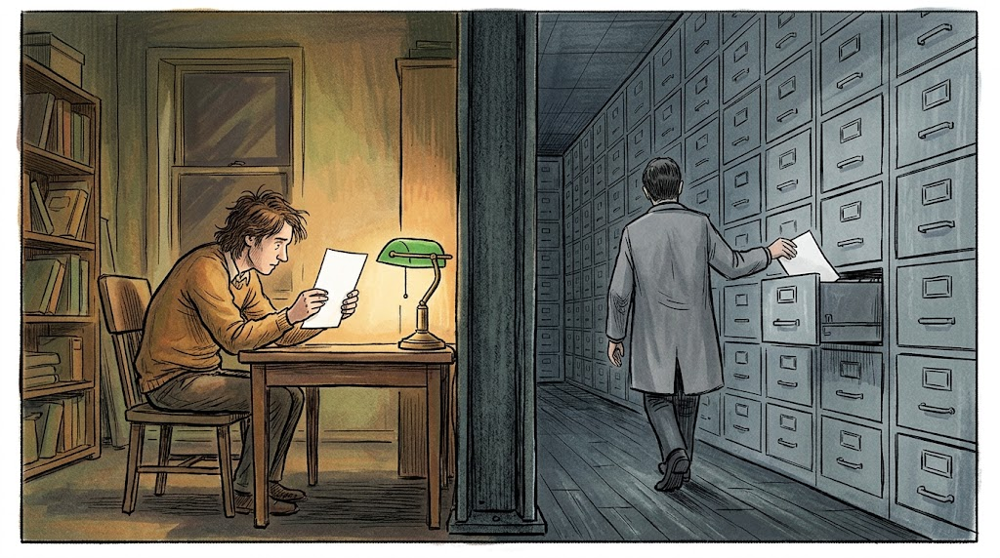

## A bot that lies to you, and a bot that writes it down

A while ago I spent a day [trying to make a threat-intel assistant fabricate things](/writing/twelve-ways-to-make-a-threat-intel-bot-lie/). It mostly held up. But the thing that kept the stakes tolerable in that exercise is something I only appreciated later: an assistant's mistake is *delivered to a person*. There is a transcript. An analyst reads the answer, and if it is wrong there is at least a chance somebody notices, and the wrongness ends there.

Then I built a connector.

A connector does not answer anyone. It reads a report and writes to the knowledge graph — entities, relationships, labels — and nobody reads the transcript. If it decides that a hospital is a threat actor, that relationship is now a row in a shared database, carrying a confidence score, structurally identical to every true relationship beside it. It will be picked up by a query months later, put in front of someone who has no idea where it came from, and acted on.

Same model. Same failure modes. Completely different blast radius.

That difference is the whole reason this project looks the way it does, and it took me longer than it should have to say it out loud: **Gemini is genuinely good at reading threat intelligence, and it should not be allowed to decide what goes in the graph.** Both halves of that are true at once, and most of the engineering lives in the gap between them.

## What the feed doesn't do

Start with why the connector exists at all.

Spend time with an OSINT feed and a pattern gets hard to unsee. A report arrives carrying a wall of indicators — hashes, domains, addresses — each correctly typed and attached. What it does not carry is a link to the actor or the malware family the report is *about*.

You see it most clearly in reports named after the thing they are not connected to. One arrived as *DarkMe RAT: A VB6 APT Trojan Turned Conventional Infostealer* — the feed's title for [a Huntress write-up](https://www.huntress.com/blog/darkme-rat-abandons-exploits), since feeds retitle — hundreds of indicators deep, and barely linked to that malware family. The information is in the title. The graph does not have it.

It is worth being fair to the feed here, because this is not laziness. An indicator is a string with a type. Extracting it is mechanical, verifying it is mechanical, and being wrong about one is cheap — a stale hash is noise. Saying "this campaign is Konni" is an attribution claim. It requires reading prose, knowing the naming landscape, and accepting that you can be wrong in a way that misleads people. Feeds ship the first kind at enormous volume and largely decline the second, and that is a defensible engineering choice.

Which means the consumer inherits the judgement work. In most organisations that is one analyst with a queue, or nobody. And the debt is invisible: a report with hundreds of indicators and no actor link *looks* productive, because dashboards count objects and it has plenty. What it cannot do is answer "what do we know about Konni" — that query returns the reports somebody linked by hand and silently omits the rest. Nobody gets paged for an incomplete answer delivered confidently.

A large, never-ending volume of low-difficulty-per-item judgement work whose absence is silent. That is an unusually good fit for automation, and an unusually bad fit for automation that can be confidently wrong.

## Where the model is genuinely good

I want to be specific about the upside before the failures, because the failures are more fun to write about and that skews things.

**Reading prose and naming what is in it.** This is most of the job, and it is close to the easiest thing a modern model does. Given a vendor write-up, Gemini reliably returns the actor, the malware family, the techniques, the sectors and the countries as structured fields conforming to the schema it was asked for. Not "understanding threat intelligence" — extracting the family name from a paragraph that mentions it three different ways and putting it in the right array.

**ATT&CK technique identification is the standout, and it surprised me.** I expected this to be the weak spot: a model inventing `T1XXX` identifiers would be easy to do and hard to notice. It essentially does not happen. Techniques it names overwhelmingly resolve to real, already-imported ATT&CK entities. I built the lookup-only restriction expecting it to throw away a meaningful amount of good output, and it throws away almost nothing. The guard that felt most severe when I wrote it is the cheapest one in the system.

**Thin reports are where it changes the answer.** A lot of feed content arrives nearly bare — a title, a short description, a handful of indicators, and almost nothing connecting it to anything. [*The Closed Quorum*](https://blog.talosintelligence.com/the-closed-quorum-inside-the-first-reported-autonomous-ai-c2-implant/), Talos's write-up of an autonomous AI C2 implant, came in with essentially one graph-building object attached. So did Manifold Security's [work on placeholder domains serving scams](https://www.manifold.security/blog/placeholder-domains-ads-serve-scams). On reports like those the connector takes a node with some indicators hanging off it and turns it into something that answers a query. The gain is much larger on thin content than on rich content, which is not the direction I assumed.

**And it fills exactly the gap the feed leaves.** On the DarkMe RAT report, the model named the family and the actor from the prose — the work that was missing. On [*Konni Hackers Target Ukraine With Malicious LNK Files and VelvetCake PowerShell Malware*](https://cyberpress.org/konni-targets-ukraine-with-velvetcake/) it named the actor, two malware families, a set of techniques, several sectors and a country. The report was already about all of that. Nothing was inferred. It was read.

That is a real capability and it is worth something. Now the other half.

## And then there's the CVE that doesn't exist

This is the failure that changed how I think about guards generally, so it gets its own section.

Gemini proposes CVE identifiers that do not exist. Not malformed — perfectly well-formed, plausible, correctly-shaped identifiers that are present at neither NVD nor CVE.org. 404 at both.

I had a guard for this. Two, actually. A format check, which a well-formed fabrication sails through by definition. And a groundedness check: refuse to create an entity whose name is not traceable to the source text, on the theory that a name the model produced from prior knowledge rather than from the document in front of it is exactly the dangerous case.

Then I looked at where the fabricated identifiers were coming from. **Some of them arrive verbatim in the source feed's own report title.**

Which means the identifier *is* in the document. Which means the groundedness check finds it, confirms it, and waves it through. The guard I had built for precisely this class of error was structurally incapable of seeing it — not weak against it, blind to it.

That distinction is the most useful thing I took from this project. A weak guard makes you cautious, because you know it leaks. A blind guard makes you *confident*, and confidence is what you are trying to earn honestly. Grounding answers "is this string in the document." It does not answer "is this a real CVE," and no amount of tuning the threshold will make it answer that, because the two questions are not related.

There was no fix at the guard level. The fix was to stop doing the thing the guard was supposed to protect. NVD owns vulnerability identifiers; the only correct operations are *look up* and *fail*. CVE creation is now removed rather than disabled — no configuration switch to flip back, and a test that asserts it stays gone.

## The hospital that attacked someone

The other failure worth dwelling on is the most damaging thing this pipeline can do, and it is the most natural mistake for a model to make.

Ransomware and extortion reporting names the breached organisation far more often, and far more prominently, than it names the gang. Count the mentions and the victim wins every time. So a naive extractor takes the most prominent organisation in the document and files it as the threat actor, and now the graph asserts that a hospital attacked somebody.

My first attempt at this read the *shape* of the name — legal-form suffixes, corporate markers. That fails in both directions, and ransomware coverage breaks it comprehensively: gangs adopt corporate-looking brands, and victims get referred to without their legal suffix. Worse, in ransomware reporting specifically, a malware name and an actor name for the same brand is *correct* rather than contradictory, so the rule that suppresses double-filing elsewhere is actively wrong there.

What works is classifying the *document* before judging any name in it — is this ransomware reporting, an influence-operation write-up, a vendor patch advisory? — and then reading the surrounding sentences as evidence about each name, across the spelling variants the name actually appears in. A name carries far less information than people building extractors assume.

And note the character of the error. The model does not occasionally slip on victim-versus-actor. It gets it wrong in a *consistent direction*, on a whole genre of reporting, every time. Systematic error is much worse than random error for a knowledge graph, because the wrongness accumulates into a pattern that looks like a finding.

## The failure that doesn't look like a failure

My favourite one, because nothing anywhere reports a problem.

Sectors in a well-kept OpenCTI instance are a curated, alias-rich vocabulary — a few dozen canonical entries doing real work. Gemini regularly proposes sector names that match none of them. Not absurd ones: reasonable-sounding, slightly-off variants.

Enable free-text sector creation and a feed will turn those few dozen canonical sectors into several hundred near-duplicates in short order. Nothing errors. No dashboard drops. No alert fires. The object count goes *up*, which reads as progress. And from that point every sector-scoped query silently returns a less complete answer than it should, forever, because the concept you are asking about has been split across variants nobody knows exist.

There is a version of AI adoption that produces exactly this and reports it as a win.

## Six times I moved the line

The pattern I did not expect, and the thing I would actually claim as a finding: six times I built the ambitious version, watched how it behaved on real content, and moved the decision *out* of the model and into deterministic code. Six for six in the same direction.

**Attack-Patterns: creation to lookup-only.** Inherited from an early proof of concept, which happily created Attack-Pattern entities from whatever technique names came back. The result was entities in the ATT&CK namespace that ATT&CK has never heard of, with no description and no relationships. Worse than absent, because every later query that assumes the namespace means something now returns them. Worth flagging as a process failure rather than a model failure — the model did what it was asked, and nobody asked whether it should have been.

**CVEs: creation to permanently lookup-only.** The blind guard, above.

**Search grounding to fetching the article myself.** I started with reference URLs pasted into the prompt and Gemini's Search grounding turned on. Three problems: the grounding quota is separate and much tighter than the token quota, so it became the binding constraint; the API does not allow search grounding together with forced JSON mode, so using it meant giving up the strongest parse guarantee available; and critically, I could not say what the model had actually read. Fetching the article myself costs no model quota and makes the input knowable. That moved an SSRF surface inside my trust boundary, which had to be handled rather than noted — the connector now makes outbound requests to URLs that arrived from a feed.

**A parallel evaluation harness to the connector owning its own accounting.** I built tooling that reproduced the connector's decision logic so batches could be scored offline. It drifted. Once the harness and the connector disagree you are measuring the harness, and the more convincing its output the worse the problem. Now the connector emits its own per-category outcomes and the offline tools only score *recorded* decisions.

**Name-shape heuristics to report-class context.** Above.

**An unsupervised critic to a subordinate one.** I added a second Gemini pass to review the first pass's output. It agreed with it. Same family, same training distribution, same blind spots — and now with two votes, which reads like corroboration and is not. The critic still exists, but it can only *subtract*: drop or reclassify, never approve, and it runs before the deterministic layer so its own verdicts are subject to the guards. Two correlated estimators are one estimator with worse error bars.

Six reversals, one direction. The guards did not get smarter — two categories had their capability *deleted*. If there is a transferable claim here, it is that one.

## So the model proposes and the code decides

Which lands on the design. Every entity or relationship the model produces goes through a funnel: shape guards, category vocabularies, controlled taxonomies, dedup, the groundedness check, OpenCTI's own relationship schema, and finally a per-category creation mode. **No stage can add anything the model did not propose.** Each can only drop or re-file. There is no path where the model's confidence unlocks something the guards refused.

The practical consequence is that reasoning about what this connector can do to a graph means reading the guard layer, not predicting a model's behaviour. That is the property I actually wanted.

It also means the unglamorous work is the work. Somebody has to write down that Microsoft Exchange is infrastructure rather than malware, so a report *about* exploiting Exchange does not file Exchange as the payload. Somebody has to write down that the defender's own EDR is a security product, so a report describing how it caught something does not record it as an adversary tool. There is no clever general rule for either. You write it once, and then it holds on every report, at 3am, on the ten-thousandth item, without attention.

That is the actual leverage, and it is worth separating from the version people usually pitch. A person plus a chatbot applies judgement per item, by hand, and the operator is the bottleneck and gets bored. A person plus an engineered funnel applies judgement *once*, to the rules, and executes it identically forever. What scales is consistent application of settled judgement. What does not scale — and is now where the time goes — is deciding what the rules should be, reading what the connector says it would have done, and knowing that NVD owns CVE identifiers.

## The part where I'm probably wrong

**The confidence score is nearly useless, and it is currently load-bearing.** Gemini reports high confidence on almost every document regardless of how thin, ambiguous or contradictory the source was. A signal that does not vary carries no information. The connector writes that self-report into the entity's score, which makes the score provenance rather than quality. Anyone treating it as a filter — including future me — would be making a mistake. This is the weakest part of the design and the next thing I want to fix.

**It is not a fix for attribution gaps, and I have a clean example.** [*Attackers Abuse ChatGPT Custom GPTs to Deliver RAT via ClickFix*](https://www.huntress.com/blog/chatgpt-custom-gpts-clickfix-rat) is a good report, well populated with indicators, with no actor attribution from the feed. Gemini named no actor and no malware family — only techniques. On the report where the missing attribution was the most interesting thing about it, the model was exactly as silent as the feed. Enrichment does not manufacture judgement that nobody exercised.

**Only Gemini has been run.** The vendor SDK is isolated to a module under twenty lines, which would make swapping providers a contained change, but I have not done it and I did not build a provider abstraction to imply otherwise. An interface with one implementation advertises portability it has not demonstrated.

**The vocabularies are a maintenance surface**, and they are the least elegant part of the codebase. Every hand-written "this software is infrastructure" entry will drift as the software landscape does.

**This is one deployment, one feed, one stretch of time.** The patterns above are what I saw, described as honestly as I can manage. They are not a benchmark and should not be read as one.

**And guards are code, so guards are wrong sometimes.** The mitigations are cautious defaults, reversibility — everything the connector creates carries an `ai-suggested` label, so undoing the whole experiment is one query — and a test suite concentrated on the guard layer. Not a belief that the guard layer is correct.

## The other side is already using AI

I was not looking for this, but several of the recent feed items I picked as examples for this piece were reports about attackers using AI: Talos's autonomous AI C2 implant, custom GPTs used for malware delivery, an Android banking trojan with [AI-built phishing overlays](https://cyberpress.org/remcontrol-trojan-steals-banking-pins/). Nobody on that side is waiting for a governance review.

That does not make defensive AI automatically correct. It makes the *absence* of it a choice with a cost. But the differentiated work is not prompting. It is knowing which decisions a model is allowed to make, and most of this project is code that says no, around a module under twenty lines that talks to the model.

## What I'd tell someone starting this

Run it read-only for longer than feels reasonable, with creation in dry-run so it logs exactly what it *would* have written. A boolean create flag forces a choice between having no evidence and having live writes; the middle setting is where the learning is.

Then promote one entity category at a time, because precision is not uniform across them and a blended average hides the problem completely. Techniques and countries resolve cleanly. Victims are the noisiest thing in the system by a wide margin. On an aggregate number, victims hide behind techniques and everything looks fine.

And accept that some categories should never be promoted. Two of mine had their capability removed rather than tuned, and that is the outcome I am most confident about.

The CVE identifiers that do not exist are not in anybody's graph. That is the entire return on the caution, it is completely invisible, and it is the reason to bother.

---

*The connector is on GitHub as [opencti-ai-enrichment](https://github.com/ashwinvis98/opencti-ai-enrichment) — Apache-2.0, with the design and the six reversals in the [README](https://github.com/ashwinvis98/opencti-ai-enrichment#how-it-decides) and the good-and-bad field notes in [OBSERVATIONS.md](https://github.com/ashwinvis98/opencti-ai-enrichment/blob/main/OBSERVATIONS.md). The project page is [here](/projects/opencti-ai-enrichment/).*
