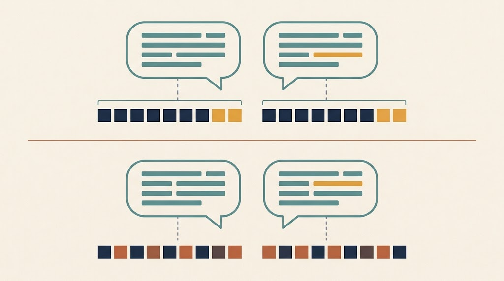
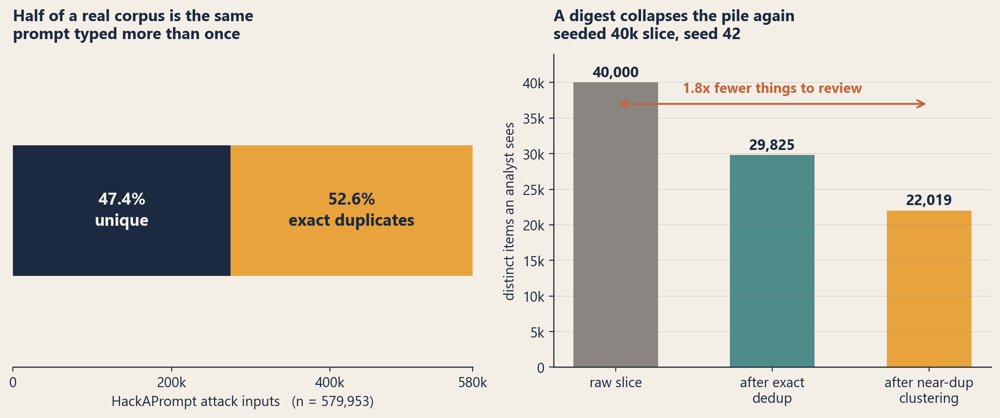
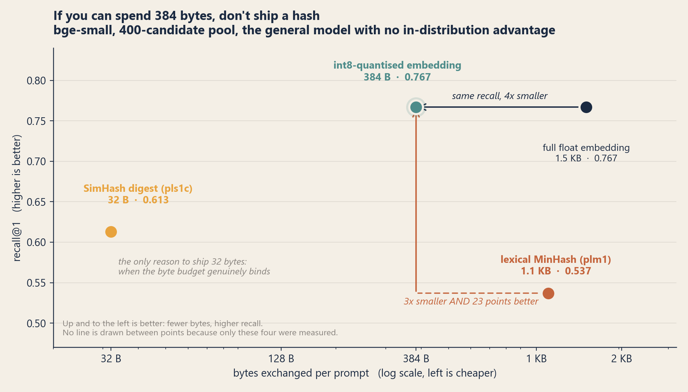

A prompt-attack feed lands with four hundred jailbreaks in it. Most are the same dozen templates with the words moved around. Your platform cannot tell: it keys each prompt on its exact text, so four hundred items is what you store, and four hundred items is what someone has to read.

Malware intelligence solved this a long time ago. `ssdeep` and `TLSH` are fuzzy hashes — similar inputs produce similar digests, so a family clusters itself and an analyst sees one thing instead of two hundred. Prompts have no equivalent.

So I built one. `promptlsh` emits a similarity digest for a prompt, and a reworded jailbreak lands close to its original. Then I measured whether it earns its place against the thing it is derived from, and it does not. For most uses you should round the embedding to 8 bits and ship that instead. This is the measurement that says so — and the three narrow cases where 32 bytes still wins.

## There is more than one way to fingerprint a prompt

The fix is obvious. The design question is not. What form should the fingerprint take? There are four plausible answers and they are not equally good.

Three of the four are formats this library emits, so they are worth naming once:

- **`plm1`** — 128-permutation lexical MinHash over word shingles. No embedding model. ~1.1 KB on the wire.
- **`pls1`** — 256-bit SimHash over a sentence embedding. 32 bytes.
- **`pls1c`** — the same, mean-centered against a shared reference. Also 32 bytes, and only comparable to digests built from the same model *and* the same reference mean.

## The corpus is more redundant than you'd guess

The problem is real and measurable. On the full HackAPrompt attack set — 579,953 inputs — **52.6% are exact duplicates** after normalisation, leaving 274,804 unique. The rate holds across models (36% to 52%) and climbs by challenge level (31% to 100%).

HackAPrompt is multilingual, and a tokeniser that stripped non-Latin text would collapse those prompts together and inflate the duplicate rate. These figures use a Unicode-aware tokeniser, so the redundancy is real rather than an artifact of tokenisation.

Beyond exact duplicates, near-duplicates matter more. On a seeded 40k slice, 25% are exact duplicates and roughly another 35% of the *unique* prompts pull into near-duplicate clusters — an overall ~1.8x collapse. Deduplicating by digest genuinely cuts what an analyst reviews. (HackAPrompt is a competition corpus, so its redundancy sits on the high side; treat the shape, not the exact factor, as the takeaway.)

## What I actually measured

Deduplication works. The engineering choice is what goes on the wire, and the options form a size/fidelity curve:

- a full float embedding — the ceiling, roughly 1.5 KB per prompt;
- an **int8-quantised embedding** — roughly 384 bytes;
- a **256-bit SimHash digest** — 32 bytes (this is what `promptlsh` emits as `pls1`/`pls1c`);
- a **dependency-free lexical MinHash** (`plm1`) — no embedding model at all.

The task: recall@1 on WildJailbreak paraphrase pairs. Each vanilla request (about 113 characters) has a jailbroken rewrite (about 979 characters) — same intent, very different surface. For each vanilla request, is its true rewrite the top match among N candidates? I ran it on a general model (`bge-small`, the clean reference) and a domain-tuned one (`0din`).

## The result that argues against my own tool

**The int8-quantised embedding keeps essentially the entire ceiling:** 0.767 against a 0.767 ceiling on the general model, 0.820 against 0.820 on the domain-tuned one, both at a 400-candidate pool, all for about 384 bytes. **The 256-bit SimHash digest gives up 11 to 21 points** against that ceiling; the best case, domain-tuned and centered, is 0.708 against 0.820. That gap is the price of shrinking 384 bytes down to 32.

The dependency-free lexical digest fares worse still. At 128 permutations a `plm1` digest runs about 1.1 KB — three times *larger* than the int8 embedding — and scores 0.537, well below it. Beaten on both axes at once, it is not a point on the size/fidelity curve. It sits off it.

The blunt version: **if you can exchange a few hundred bytes per prompt, ship the int8-quantised embedding, not a hash.** That is what the numbers say, and there is no point pretending otherwise.

This needs no code from `promptlsh`: take the embedding you already have, divide each vector by its own max absolute value over 127, round to `int8`, and keep the scale factor alongside it. That is symmetric per-vector quantisation in three lines of numpy, and it is what `eval/wire_formats.py` measures.

## What the hashing buys anyway

So why does the 32-byte digest exist at all? The measurement narrows it to three honest cases.

First, **where the byte budget genuinely binds.** Thirty-two bytes against 384 is about a twelvefold difference in storage and index size. Attach a fingerprint to every observable across a high-volume feed and that multiple stops being academic.

Second, **where you would rather not put something near-invertible on the wire.** A SimHash of an embedding is lossy in a way a quantised embedding is not — the quantised vector is close to recoverable, the bit-signature much less so. That is a difference in *degree of exposure*, not a privacy guarantee, and I would not dress it up as one.

Third — and this one I only measured while writing this up — **where the evasion you actually face is reordering.** Shuffling the words of a prompt keeps its meaning and destroys every word shingle, which makes it the cheapest possible attack on a lexical digest. It works completely: shuffle the words and `plm1` similarity falls to **0.001**, indistinguishable from two unrelated prompts. The semantic digest barely notices. On the same 300 prompts, `pls1` holds **0.843 bit agreement** — an implied cosine of **0.881**, against a raw-embedding cosine of 0.885. Almost none of the signal is lost.

The 32-byte digest is more than a degraded embedding. Against a one-line evasion that reduces the lexical digest to noise, it is categorically more durable. That is a third reason to ship it, and a harder one to argue with than the byte budget.

## Putting the options side by side

| Format | Bytes | recall@1 | Survives word reorder? | Needs a model? |
|---|---|---|---|---|
| full float embedding | ~1,536 | 0.767 | yes (0.885 cosine) | yes |
| **int8-quantised embedding** | **384** | **0.767** | yes | yes |
| `pls1c` SimHash digest | **32** | 0.613 | **yes (0.881 implied)** | yes |
| `plm1` lexical MinHash | ~1,160 | 0.537 | **no (0.001)** | **no** |

All figures `bge-small` at a 400-candidate pool, from `eval/wire_formats.py`. The reorder
column is mean similarity between a prompt and its own word-shuffled copy.

I have deliberately left out a column for invertibility. It matters — it is the second case
above — but I have not measured it, and turning "a bit-signature leaks less than a quantised
vector" into a tidy High/Medium/Low rating would be inventing precision I do not have. That
is the same mistake as the cross-org figure below, and once is enough.

**The table only covers the wire, and lookup is a separate axis.** These formats do not
index the same way. Quantised and full vectors want approximate nearest-neighbour search —
HNSW, IVF, the usual vector-database machinery. A 256-bit signature is a Hamming-distance
problem: XOR and popcount, which is a single instruction on modern hardware, and which
multi-index hashing partitions cheaply. I have not benchmarked the two at scale, so I will
not claim a latency winner. But if your deployment constraint is index cost rather than
wire cost, that is a second axis the recall numbers above say nothing about.

The lexical `plm1` has exactly one reason to exist, and it is neither size nor accuracy:
**zero ML dependency.** No model to download, pin, or run; fully deterministic and offline.
Use it when you cannot run an embedding model at all. Otherwise the embedding path wins.

Two smaller findings worth carrying: mean-centering (`pls1c`) buys the digest about 5 to 6 points and is essentially free, and a domain-tuned model beats a general one at both the ceiling and the digest. But a general model already gives a usable result — around 0.61 recall@1 at a 400-candidate pool — so no fine-tuning is required to get value.

## The hard part: correlating across feeds barely works

Everything above measures one corpus against itself. The reason you would attach a
fingerprint to a shared observable in the first place is different: so two organisations can
discover they are looking at the same attack. I had a number for that, and it was wrong.

I used to quote the digest finding about **2.9x** the overlap of exact matching (35.1% vs
12.2%) and I labelled it cross-org correlation. It came from randomly splitting *one*
high-redundancy corpus in half. Both halves were drawn from the same competition, so they
shared wording by construction. It measures the exact-versus-fuzzy gap on closely related
material, which is a real result, and it says nothing whatsoever about two independent
organisations. Labelling it cross-org was my error.

So I ran the actual test: five independently collected public corpora, treated as five
organisations, with positive controls and a null baseline to distinguish "found nothing"
from "measured it wrong." The result is worse than the number I retracted.

**On literal text, cross-feed correlation is essentially zero.** Independent feeds do not
share wording, so a wording-based fingerprint has nothing to grip. Across every pair of
feeds, in both directions, the highest match rate was 0.07%.

**Semantically it is real but conditional.** Two independently assembled collections of
human jailbreaks overlapped by **10 to 21 percent** — genuinely useful, and a floor rather
than a ceiling, because the threshold I used is stricter than a typical true pair. But feeds
that collect different *kinds* of artifact — jailbreak wrappers versus bare harmful requests
— barely correlate at all regardless of who gathered them. And the two *largest* overlaps,
at 25 to 39 percent, turned out to be between datasets built from one another. Those measure
my pipeline working, not the world agreeing.

A digest reliably collapses redundancy **inside** a feed, which is
the 1.8x result earlier. Treat cross-organisation correlation as opportunistic, and expect it
only between feeds that collect the same kind of thing. Full tables in
[`RESULTS.md`](https://github.com/ashwinvis98/promptlsh/blob/main/RESULTS.md) §2b.

## What this doesn't show

- These are matching rates on one dataset's paraphrase pairs, not a detection benchmark. The digest answers "are these the same attack reworded," not "is this an attack."
- The strongest model (`0din`) is heavily in-distribution: its model card reports pre-training on 161,396 WildJailbreak pairs, which is the evaluation set itself. `bge-small`, a general model without that exposure, is the honest reference, and it supplies every headline number here.
- Recall@1 degrades as the candidate pool grows — the centered digest drops from 0.613 at 400 candidates to 0.534 at 1000 on the general model, as expected for nearest-neighbour retrieval.
- I have not measured invertibility, only argued about it. The claim that a bit-signature exposes less than a quantised vector is structural reasoning, not a result.
- **The candidate pools are small.** Everything here runs at 400 and 1,000 candidates, and recall already falls from 0.613 to 0.534 across that gap. A production feed indexes hundreds of thousands of observables, and nothing in this evaluation tells you where the curve lands there. I would expect it to keep falling. If you are sizing this for real, measure it at your own scale before trusting any number above.
- **Reordering is one evasion, not the category.** The robustness result tests word-shuffling, which is the cheapest attack available. Synonym substitution, inserted noise, and structural rewrites are all untested here, and there is no reason to assume the digest holds up equally against them.

## So what should you actually ship?

The whole measurement collapses into three cases.

1. **You can spend a few hundred bytes per prompt.** Ship the int8-quantised embedding. It
   keeps the full retrieval ceiling — 0.767 against 0.767 — at a quarter the size of the
   float vector. This is the default, and it is not this library.
2. **You are pinned to a tiny wire budget, or you would rather not transmit something close
   to invertible.** Ship `pls1c`, the mean-centered 256-bit digest. You pay about 15 points
   of recall for a twelvefold size reduction, and you get reorder robustness that the
   lexical digest cannot offer.
3. **You cannot run an embedding model at all** — air-gapped, edge, or a pipeline that must
   stay deterministic with no ML dependency. Use `plm1`, and know what you are accepting: it
   is both larger and less accurate than the int8 embedding, and a single word-shuffle
   reduces it to noise.

If none of those describe you, you probably do not need a fingerprint yet.

## Reproduce it

Every number above comes from `eval/` in the [`promptlsh`
repo](https://github.com/ashwinvis98/promptlsh), with the full tables in
[`RESULTS.md`](https://github.com/ashwinvis98/promptlsh/blob/main/RESULTS.md):

- `eval/wire_formats.py` — the recall@1 comparison across all five wire formats, and the
  reorder-robustness test. Fixed seeds, so it reproduces exactly.
- `eval/cluster_corpus.py` — the corpus redundancy figures.

Everything runs on public corpora — HackAPrompt, JailbreakBench, HarmBench, WildJailbreak —
and no corpus is committed to the repo. WildJailbreak is gated, so you will need to accept
its terms on HuggingFace before the paraphrase-pair evaluation will run.
