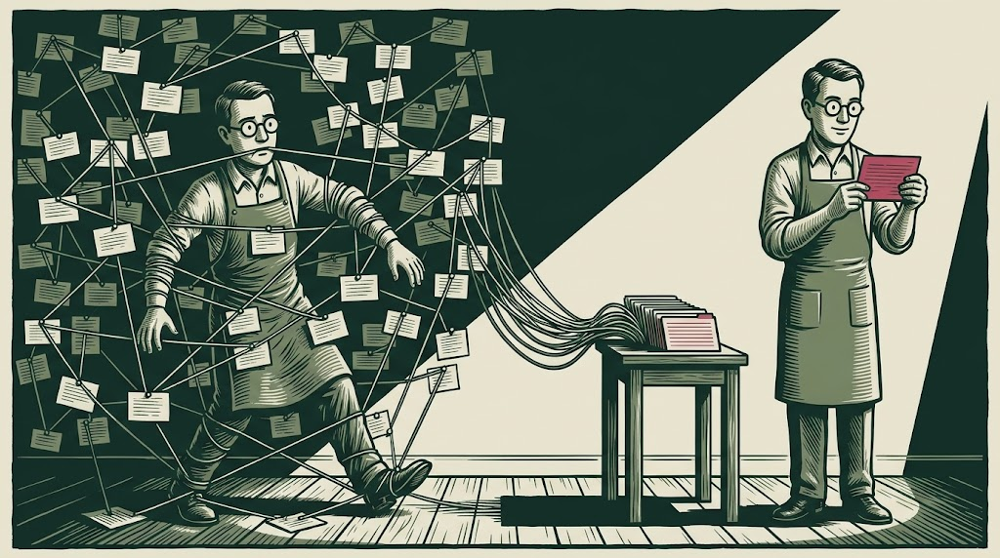
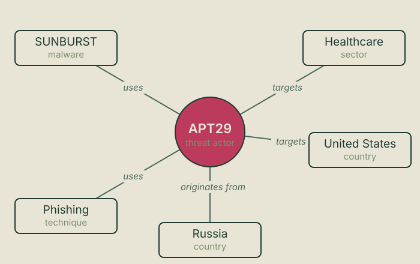
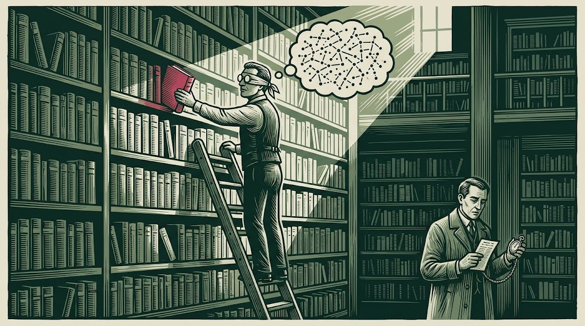
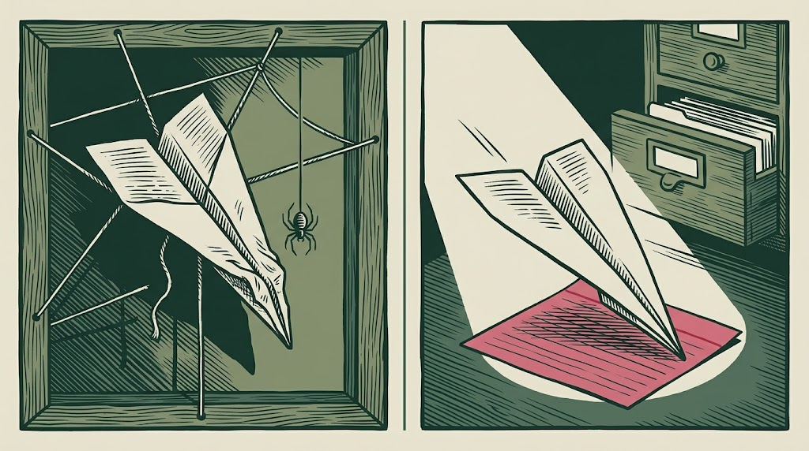
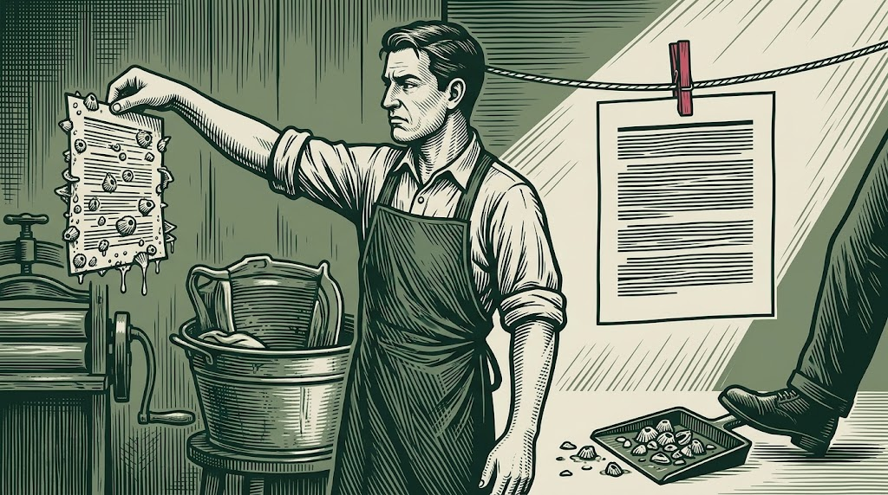
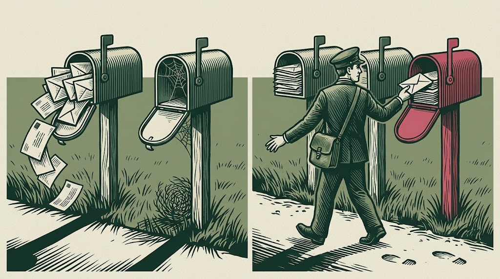
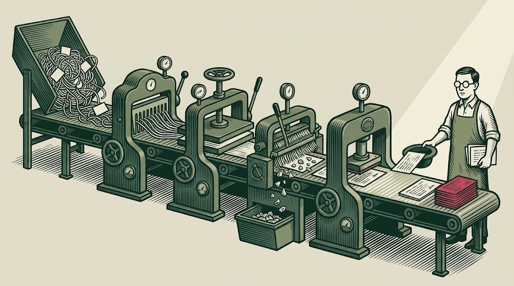
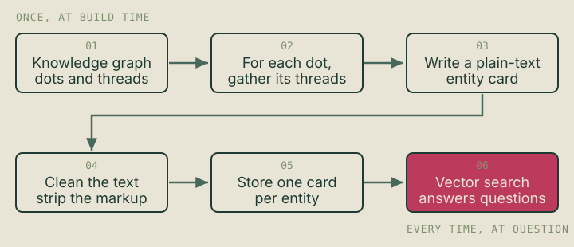

## A question that should have been easy

Picture an analyst at 9 a.m. with a coffee and a simple question:

> "What malware does APT29 use?"

APT29 is one of the most-documented hacking groups on earth: a Russian state-sponsored espionage crew, publicly attributed to Russia's foreign intelligence service, and the group behind the SolarWinds compromise. The answer to that question absolutely exists in my data. I had pulled in years of threat intelligence: the hacking groups, the malware families they run, the techniques behind their operations, the vulnerabilities they weaponise, and — crucially — the *connections* between all of them.

So when I built an AI assistant on top of that data and asked it that exact question, I expected a clean answer.

I got a shrug.

Not because the fact was missing. Because of *how* the fact was stored. Fixing that turned out to be the most interesting engineering problem in the whole project. This is the story of why a capable AI couldn't answer an easy question, and the surprisingly dull idea that fixed it.

To get there you need two concepts. I promise to keep them friendly.

## Concept one: a knowledge graph is a spider web

Most people picture data as a spreadsheet: rows and columns, neat little boxes. Threat intelligence doesn't work like that, because the *whole point* is the connections.

Think of it as a spider web instead. Every **dot** — the technical word is *node* — is a thing:

- a hacking group (APT29)
- a piece of malware (SUNBURST)
- a technique (phishing)
- an industry they attack (healthcare)
- a country they target (the United States)

Every **thread** between two dots is a relationship:

- APT29 **uses** SUNBURST
- APT29 **targets** healthcare
- SUNBURST **communicates using** DNS

This structure is called a **knowledge graph**, and it's genuinely the right way to model this world. The intelligence *is* the web. A hacking group with no connections is just a name; it only becomes useful when you can trace the threads out to what it does, what it uses, and who it hurts.

The industry standard for writing this down is **STIX**. In STIX language the dots are "domain objects" and the threads are "relationship objects." You don't need the jargon. Just hold onto the picture: **dots and threads. A web.**


Here's that same picture drawn precisely:



That's the data. Now the second concept: how an AI actually searches it.

## Concept two: how an AI looks things up, and why it's like a librarian who only reads vibes

Modern AI assistants don't memorise your private data. They use a technique called **RAG** — *retrieval-augmented generation*. It's a two-step dance:

1. **Retrieve:** when you ask a question, the system first goes and *finds* the most relevant documents from your data.
2. **Generate:** it hands those documents to the language model and says "answer the question using only these."

Step 2 is the famous part. Step 1 is where everything quietly succeeds or fails.

So how does step 1 find the most relevant documents? Not with keywords like an old search engine. It uses **meaning**. Every document is converted into a long list of numbers — a *vector* — that captures its meaning. Your question gets converted the same way. Then the system finds the documents whose numbers sit closest to your question's numbers.

The everyday analogy: imagine a librarian who can't read the words but has an uncanny sense for the *vibe* of every book. Ask for "something about sad robots" and they'll walk straight to *Do Androids Dream of Electric Sheep?* without matching a single keyword. That's vector search, and it's brilliant at "find me text that means roughly this."

But notice the assumption hiding in there: **the answer has to live inside a single document**, written as text, for the vibe-matching librarian to find it.

That's the trap.



## The wall: the librarian can't see the threads

Go back to the question. "What malware does APT29 use?"

In the spider web, the answer is a **thread** — the line connecting the APT29 dot to the SUNBURST dot, labelled "uses." It is not written anywhere as a sentence. It's a structural connection between two separate things.

When I first loaded the data I did the obvious thing: handed the raw structured records to the system and let it chop them into chunks. Here's what went wrong.

The **APT29 record** and the **SUNBURST record** are separate items. Vibe-matching found the APT29 record fine, but that record didn't contain the sentence "APT29 uses SUNBURST." The connection lived *outside* both records, in the thread. And the **relationship** itself, once chopped up, looked like machine gibberish: a couple of ID codes and the word "uses." It had no vibe. The librarian walked straight past it.

So the fact was in my data, but invisible to the one mechanism that had to find it. The AI wasn't dumb. It was searching a web with a tool that can only read pages.

This isn't a quirk of my project — it's a well-known limitation. When Microsoft introduced an approach called [GraphRAG](https://www.microsoft.com/en-us/research/blog/graphrag-unlocking-llm-discovery-on-narrative-private-data/) in 2024, it named exactly this problem: ordinary vector search struggles with questions that depend on the *relationships between* things, because it treats every chunk as an isolated island of meaning. [IBM's explainer](https://www.ibm.com/think/topics/graphrag) makes the same point. Single-fact lookups are fine. Multi-step, connect-these-things questions are where plain vector search falls down.

The common fix is to bolt a graph engine onto the system so it can walk the threads at question time. That works, but it's a whole extra moving part: a second database, more infrastructure, more that can break. I wanted something simpler.



## The fix: stop storing a web, start writing biographies

Here's the reframe that cracked it.

The vibe-librarian is good at finding *text that means something*. So instead of asking it to somehow see the invisible threads, I decided to **write the threads down as text** — ahead of time, before any question is ever asked.

For every dot in the web, I generate one plain-language document. Think of it as a short biography, or an index card. It describes the entity *and pulls in everything connected to it*. The card for APT29 doesn't just say who APT29 is. It walks out along every thread and writes each one down as a readable line:

- Uses malware: SUNBURST, WellMess, MiniDuke…
- Uses techniques: phishing, valid accounts, PowerShell…
- Targets sectors: government, defence, healthcare…
- Targets countries: United States, Ukraine, Germany…
- Originates from: Russia

I call these **entity cards**. Once the connections are written *inside* the card as sentences, they have a vibe the librarian can feel. Now when someone asks what malware APT29 uses, vibe-matching finds the APT29 card and the answer is sitting right there in plain text. No graph-walking required at question time.

The graph traversal still happens. I just do it in advance and bake the results into readable documents. The hard work happens once, when the card is built. Every future question gets to be easy.

Here's an APT29 card from the system, trimmed for length — each relationship list is longer in the real thing, and I've cut a trailing provenance block:

```
Threat Actor: APT29

Summary
APT29 is a Russian state-sponsored threat group attributed to Russia's Foreign
Intelligence Service (SVR). It has targeted governments, think tanks, healthcare,
and energy organizations across the US and Europe, and is known for long-term
persistent access and strong operational security.

Aliases
- Cozy Bear
- The Dukes
- Midnight Blizzard
- NOBELIUM
- UNC2452

Relationships

Uses malware
- SUNBURST
- WellMess
- MiniDuke

Uses attack-pattern
- Spearphishing Attachment
- Valid Accounts
- PowerShell

Targets sector
- Government Administration
- Defense
- Healthcare

Targets country
- United States
- Ukraine
- Germany

Originates-from country
- Russia
```

Read it the way the AI does. Every line is a self-contained fact in plain English. "Uses malware: SUNBURST." A person can read it, the vibe-librarian can feel it, and the language model can quote it back with confidence. The invisible thread became a visible sentence.

One honest limit on that. The lists are capped — each relationship type shows up to fifty entries, most recent first, and then says how many more there are. A heavily-documented group has more connections than any single readable document should carry, so the card is the well-attested core rather than the complete set. That's a deliberate ceiling, not an accident, but it does mean "what does this group use?" is answered from a generous sample rather than an exhaustive one.


## Cleaning the text so the librarian isn't distracted

There's a catch that sounds trivial and absolutely is not.

The source descriptions were messy. They came from dozens of feeds and were full of things meant for a web browser rather than a reader: HTML tags, Markdown links, and academic-style citation markers like `(Citation: FireEye 2017)`. To a human skimming, that's visual clutter. To the vibe-librarian it's poison, because it matches on meaning and it cannot tell the difference between meaning and markup. A description crusted with list tags and citation markers has a muddier vibe than the same description in clean prose. Muddy vibe, worse matches.

So before a card gets stored, its text runs through a fixed cleanup routine that always does the same steps in the same order: strip HTML tags, turn Markdown links into just their words, delete citation markers, normalise line endings, repair sentences that got mashed together when tags were removed, collapse runaway whitespace, remove leftover heading symbols.

That fifth step is a good example of how fiddly "simple" text is. When you rip out an HTML tag, two sentences can slam together: `was compromised.The attackers`. You want a space so it reads `was compromised. The attackers`. Easy — until you realise the same rule wrecks `Ransomware.Live`, a real threat-intel site, by turning it into `Ransomware. Live`. So the rule has to know when a full stop ends a sentence and when it's part of a name. Small detail, real consequences for how the answer reads.



## One entity, one document

Here's a design choice worth being precise about, because it's easy to overstate.

Retrieval systems chop documents into chunks — a few hundred tokens each — so that search returns a tight passage rather than a whole book. That chopping is where a lot of RAG quality goes to die: split a document in the wrong place and you hand the model half a list.

I didn't disable chunking. The retrieval store runs its default strategy, and a long card can still split across two chunks. What I did instead was write the cards so that chunking has very little to do. Each card covers one entity and usually lands in a few hundred tokens — short enough that the default strategy typically keeps it whole, and structured so that if it does split, the halves are still coherent. Every line is a complete, self-contained fact, so a fragment is a shorter answer rather than a broken one.

That's a weaker claim than "I turned chunking off," and it's the true one. The card isn't immune to being split; it's built so that being split doesn't hurt much. Coherence by construction rather than by configuration.

The practical result: when the librarian pulls the APT29 card, it generally gets the whole thing in one grab — summary, aliases, malware, techniques, targets, origin — instead of an arbitrary slice of a much larger document that happened to mention APT29 in passing.

## A neat bonus: reversing the arrows

Once you're writing threads down as sentences, you get a choice most people miss: **which direction do you write them in?**

A thread naturally points one way. APT29 → targets → United States. So the APT29 card lists "Targets country: United States." Fine.

But now imagine an analyst asks about the *United States* instead. Which groups target the US? If the thread is only written on the APT29 card, the country card knows nothing. It would be a lonely dot with coordinates and no threat context.

So for places, industries and other victim-side entities, I deliberately walk the threads **backwards** and write the inbound ones down too. The card for a country lists the groups that originate from it and the groups that target it — inbound arrows, written as prose. Now the country card answers "who's coming for this country?" on its own.

It's a small idea with a large payoff: the same web, read from both ends, so the answer is in whichever card the question lands on.



## Did it work?

Yes, and at a scale that made the payoff obvious.

The pipeline now turns the threat-intelligence graph into one card per entity — a library that grows with the landscape it mirrors, covering hacking groups, malware, techniques, vulnerabilities, mitigations, industries and countries. Each is a clean, self-contained, plain-text story of one entity and its neighbourhood, indexed into a knowledge base an analyst can simply talk to.

Ask what malware APT29 uses and the APT29 card surfaces, malware list and all. Ask who targets the healthcare sector and the healthcare card answers, because the inbound threads are written down. Questions that used to get a shrug now get a sourced, specific answer, and the assistant can point at the exact line it used, because that line is real text in a real document.

The architecture stayed refreshingly boring, too. No query-time graph engine, no second database, no multi-hop orchestration. Do the graph work once, write it down as good prose, and let a plain vector search do what it's good at. The complexity moved from question time, where it's slow and fragile and happens constantly, to build time, where it happens once and I can inspect the output with my own eyes.



Drawn precisely, the same flow:



Paying that build cost once, rather than on every question, does mean the cards have to be kept current as the graph moves underneath them. That turned into its own engineering problem, and it's the subject of [a separate piece on keeping the library fresh](/writing/from-half-a-day-to-a-coffee-break/).

## When does this make sense?

This isn't magic pixie dust for every AI project. It works under a specific set of conditions, and it's worth being honest about them.

**Your data is genuinely a graph.** If your knowledge is already prose — support articles, contracts, policies — you don't have this problem and normal RAG is fine. The card trick pays off when the value is in the connections.

**The set of entities is bounded and mostly stable.** Mine changes gradually rather than by the second. That makes "generate a card per entity and refresh it" practical.

**You can afford to do the work up front.** I pay a build cost to make every question cheap. If your entities and relationships churned constantly, query-time graph traversal might win instead.

The tradeoff stated plainly: a one-time build cost and some storage, in exchange for simpler, faster, more reliable answers and the ability to *read* exactly what the model will see. For a knowledge base queried far more often than it changes, that's a trade worth making every time.

I'll also name what this doesn't solve. Writing the threads down fixes retrieval, not correctness. If two records describe the same real-world group under different names, you get two thin cards instead of one complete one, and the assistant will answer confidently from whichever it found. That problem is entirely separate from this one, and it's the subject of [the companion piece on teaching a database that a dozen names can mean one adversary](/writing/cozy-bear-the-dukes-and-apt29/).

## The takeaway

The lesson that stuck has almost nothing to do with security and everything to do with how AI meets messy real-world data:

> **An AI can only find an answer that's actually written down somewhere it can look.**

My facts existed. They were stored as connections in a web, and my search tool could only read pages. The fix wasn't a fancier model or a bigger graph engine. It was rewriting the web as pages, carefully, once, so the connections became readable text. A spider web became a stack of biographies, and the machine could read it.

If you're building anything that answers questions over connected data, ask the uncomfortable version of that 9 a.m. question: *is the answer actually written down in a document my system can retrieve, or is it hiding in a thread between two documents that will never be found together?*

Answer that honestly and you'll know whether you need a spider web or a stack of index cards.

---

### Sources and further reading

- MITRE ATT&CK, APT29 (G0016) — <https://attack.mitre.org/groups/G0016/>
- Microsoft Research, "GraphRAG: unlocking LLM discovery on narrative private data" — <https://www.microsoft.com/en-us/research/blog/graphrag-unlocking-llm-discovery-on-narrative-private-data/>
- IBM, "What is GraphRAG?" — <https://www.ibm.com/think/topics/graphrag>
- Weaviate, "RAG and GraphRAG" — <https://weaviate.io/blog/graph-rag>

*External sources were paraphrased and summarised rather than quoted.*
